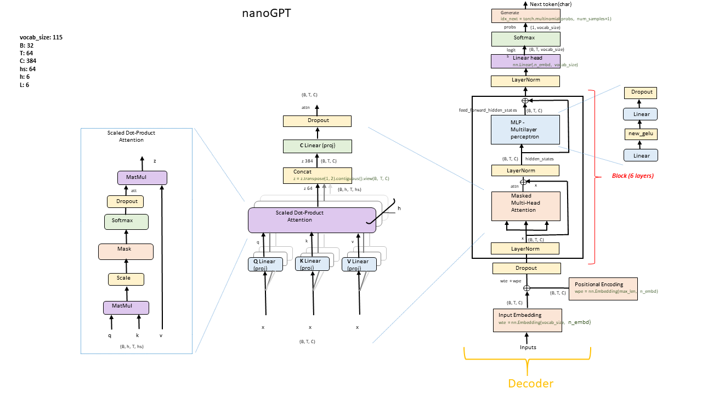

# GPTLab

## Introdução
Este projeto foi baseado no trabalho do Anderej Carpathy [“Let's build GPT: from scratch”](https://www.youtube.com/watch?v=kCc8FmEb1nY)
Adaptações foram feitas para tornar o aprendizado do modelo mais didático.
O objetivo deste trabalho é ajudar as pessoas a se familiarizarem com a estrutura de modelos de linguagem auto regressivo e noções básicas de tensores, PyTorch e redes neurais. Muitas dessas alterações foram baseadas no código fonte localizado em [huggingface/transformers PyTorch implementation](https://github.com/huggingface/transformers/blob/main/src/transformers/models/gpt2/modeling_gpt2.py)

Se você não é um profissional de aprendizado profundo e quer apenas compreender a arquiteturas desses novos modelos LLMs (Grande Modelos de Linguagem), a maneira mais rápida de começar é treinar um modelo GPT de tamanho 200k(treinamento em CPU) ou de tamanho de 10M(treinamento em GPU com 4 GB) nas obras de Machado de Assis ou nas obras de Shakespeare.

&nbsp;  
## Modelo GPT
Os modelos de linguagem baseados em inteligência artificial têm desempenhado um papel cada vez mais importante na geração de  texto coerente e relevante com base em um contexto fornecido. Um desses modelos notáveis é o GPT (Generative Pre-trained Transformer), desenvolvido pela OpenAI. Neste projeto, exploramos o potencial do nanoGPT como uma ferramenta de auxílio para o entendimento da arquitetura dos Grandes Modelos de Linguagem(LLM). O nanoGPT, uma versão compacta e acessível do GPT criada por Andrej Karpathy e disponível no repositório do [GitHub](https://github.com/karpathy/nanoGPT). 


O nanoGPT é baseado no modelo GPT, que é um modelo de linguagem baseado em inteligência artificial que foi treinado em grandes quantidades de dados textuais para aprender a prever a próxima palavra em uma sequência de palavras. Ele é baseado na arquitetura [Transformer](https://arxiv.org/abs/1706.03762), mas utiliza apenas o decoder e remove as partes relacionadas ao encoder (ver figura abaixo).
&nbsp;


&nbsp;  
&nbsp;  
O nanoGPT pega a arquitetura do Transformer e a estende usando aprendizado não supervisionado em uma quantidade de dados de texto. Este processo é conhecido como pré-treinamento. Durante o pré-treinamento, o nanoGPT é exposto a um corpus de texto, como os contos de Machado de Assis ou a uma parte da obra de Shakespeare, e aprende a prever o próximo caractere em um determinado contexto. Ao fazer isso, o modelo aprende os padrões estatísticos e as estruturas sintáticas da linguagem humana.
&nbsp;  
<br/>


   
&nbsp;  
## Tokenizer
Nós utilizamos um tokenizador de nível de caractere neste projeto que opera no nível de caracteres individuais. Em contraste com a tokenização em nível de palavra, em que o texto é dividido em palavras ou subpalavras individuais, a tokenização em nível de caractere divide o texto em seus caracteres constituintes.

Um tokenizador de nível de caractere divide o texto em caracteres individuais e representa cada caractere como um token separado. Ele oferece uma representação refinada do texto e pode lidar com palavras raras ou não vistas de forma eficaz, mas pode perder a semântica no nível da palavra e aumentar o comprimento da sequência.

Uma vantagem de utilizar este tipo de tokenizador é que o número de parâmetros da matriz embeddings é menor. 

```wte = nn.Embedding(config.vocab_size, config.n_embd)```

Quando utilizamos o treinamento em GPU o tamanho do vocabulário é 115 e a dimensão do vetor de embeddings é 384 o que dá 115x384 = 44160. O número total de parâmetros deste modelo é 10.683.264, então a camada de embeddings tomaria 0,41% deste total. Se utilizássemos o tokenizador do GPT-2 que usa o algorítmico [BPE](https://huggingface.co/learn/nlp-course/chapter6/5?fw=pt) para tokenização, o tamanho do vocabulário seria de 50257 o que aumentaria bastante o tamanho do modelo em 50257x384 = 19.298.688 e a camada embeddings tomaria 64,46% do tamanho do modelo. Em resumo, é melhor utilizarmos um tokenizador em nível de caracteres para diminuirmos o consumo de memória e o tempo de processamento.

Mas a nossa missão é permitir o treinamento deste modelo para a maioria dos usuário que tem o computador comum , sem uma poderosa GPU que custa muito dinheiro.

&nbsp;  
## Instalação

Dependencies:

- python > 3.9
- [pytorch](https://pytorch.org) > 2.0
- sklearn==1.2.2
- gensim==4.3.1


&nbsp;  
## Eu tenho uma GPU

Para treinamento em GPU com pouca memória (4GB) os  hiperparâmetros são ajustados para:
```
n_embd = 384
n_head = 6
n_layer = 6
dropout = 0.2
batch_size = 32 # Quantas sequências independentes processaremos em paralelo?
block_size = 64 # Qual é o comprimento máximo de contexto para previsões?
O script “training_nanoGPT_GPU.py” 
E utilizar o arquivo obras_machado_de_assis_conto.txt como corpus de treinamento
```


Isso gera algumas amostras, por exemplo:

```
pé, que uma sobretupou o lenço
do Crispim Soares; mas apressaram
desde que estidade pagou. Quando o rajor se o ratador da vida
Luísa; mais só depois e adiantou o amor, — e razão uma simbina coisa
idade que tornava às esperanças daquele semitério, eu fosse, levantando a esta cartina
de dois banquavas, botaria do pobre estudo do coração era verdade.
— Tudo o que custava estão! o meu espírito e excio?
— Não.
— Que é isso. Aleganda curir por que estivesse é meia. Quanses? tomava
a exputo do marido?
— De ser isto: leitando-me a lugar à casa, outro voltou para certa comunicação, sabia
que perdia dela nentrara, olhava com a rua sagradadeira, enfim, aprovantando tacrefundo a
fechação e dos novos. Nã
```
Nada mal para um modelo de nível de personagem após 30 minutos de treinamento em uma GPU. 

&nbsp;  
## Eu só tenho um PC comum

(ou outro computador barato). Não se preocupe, ainda podemos treinar o nanoGPT, mas queremos diminuir um pouco as coisas. 

Para treinamento em CPU recomendo o uso do arquivo “train_nanoGPT_cpu.py” em que os  hiperparâmetros são ajustados para reduzir a memória necessária e o tempo de processamento. Você pode utilizar tanto o arquivo shakespeare.txt como corpus de treinamento ou o arquivo machado_de_assis_conto.txt.

Nosso tamanho de contexto é de apenas 64 caracteres em vez de 256 e o tamanho do lote apenas 32 exemplos por iteração, não 64 Também usaremos um Transformer muito menor (4 camadas, 4 heads, tamanho do embeddings de 64) e diminuiremos o número de iterações para 5.000. Como nossa rede é muito pequena, também facilitamos a regularização (`--dropout=0.0`). Isso ainda é executado em cerca de 14 minutos, mas nos dá uma perda de apenas 2,02 e, portanto, também amostras piores, mas ainda é uma boa diversão:
```
batch_size = 32
n_embd = 64
n_head = 4
n_layer = 4
dropout = 0.0
batch_size = 32 # Quantas sequências independentes processaremos em paralelo?
block_size = 32 # Qual é o comprimento máximo de contexto para previsões?
```

Isso gera algumas amostras, mas de uqalidade inferior do gerado acima com GPU, por exemplo:

```
Maltia avas, cão respípas dais,
escisse.
— A cabédil cá olhmer uma cardarmo.
Undidar servedaridos.
— Acoisa da atera deste que aos escriles. Mus dos? Estum como o frincho era e tricoceidose a cara do e soas desmoras em no aboréções. Com lesconte-lo não camas acas tomão divurado crimo o dia que
ei coluva disifro um parter vez as calbécos altário. Vegura e im que lhão.
— Mentros:
— Diram rande
Zreza. Eras,
portico que afelta,
trilhos, a empriserque aveda; e mau carma ergunde entr, que quano  é o coônio dimprande e Evoi que ambera esam, não ter o larezes.
```

Quando utilizamos o treinamento em CPU o tamanho do vocabulário é 115 e a dimensão do vetor de embeddings é 64 o que dá 115x64 = 7360. O número total de parâmetros deste modelo é 207.936, então a camada de embeddings tomaria 3,54% deste total. Se utilizássemos o tokenizador do GPT-2 que usa o algorítmico [BPE](https://huggingface.co/learn/nlp-course/chapter6/5?fw=pt) para tokenização, o tamanho do vocabulário seria de 50257 o que aumentaria bastante o tamanho do modelo: 50257x64 = 3.216.448 e a camada embeddings tomaria 94,13% do tamanho do modelo.

<br/><br/>
## Experimento 1

**Visualizando posicional embeddings e token embeddings(GPU)**

Os vetores de palavras, também conhecidos como word embeddings, são representações numéricas de palavras que capturam relações semânticas e sintáticas entre palavras com base em seu uso contextual. Esses vetores são tipicamente de alta dimensão, tornando difícil visualizá-los diretamente.
Para superar esse desafio, o t-SNE pode ser aplicado para reduzir a dimensionalidade dos vetores de palavras, preservando suas relações relativas. O algoritmo t-SNE visa mapear cada vetor de alta dimensão para um ponto bidimensional em um gráfico de dispersão, onde vetores semelhantes são posicionados próximos uns dos outros e vetores diferentes são posicionados mais distantes.
O arquivo `word_cluster_plot.py` gera duas imagens
- Token embeddings
- Posicional embeddings
&nbsp;  &nbsp;  

Para o treinamento em GPU que utilizou hiperparâmetros da arquitetura do modelo maiores e obteve uma função perda de 1,44 os resultados abaixo mostram que para o gráfico de posicional embeddings formou-se um padrão nos embeddings variando de 0 a 63 (máximo comprimento da sentença = 64).
Para o gráfico de token embeddings observa-se que houve o agrupamento de tokens(caracteres) que são próximos quando o modelo foi treinado. As vogais minúsculas estão próximas assim como as consoantes minúsculas que por sua vez estão próximas do grupo das vogais minúsculas. Isso era de se esperar porque as sílabas mais comuns são formadas pelas estas consoantes e estas vogais, ex: pa,ma,ma etc...
Observa-se também que as vogais maiúscula estão próximas assim como as consoantes maiúscula bem como os sinais de pontuação. Os números estão próximos também.
&nbsp;  
<div align="left">
  &nbsp;&nbsp;
  
</div>
<br/>

**Visualizando posicional embeddings e token embeddings(CPU)**

Para o treinamento em CPU (modelo de 200k de parâmetros) que utilizou hiperparâmetros da arquitetura do modelo reduzidos e obteve uma função perda de 2,06 os resultados abaixo mostram que para o gráfico de posicional embeddings não formou-se um padrão nos embeddings (máximo comprimento da sentença = 32).
Para o gráfico de token embeddings observa-se que houve um agrupamento menor de tokens(caracteres) que estão relacionados comparado com o modelo de 10M de parâmetros.
Pelos gráficos abaixo nota-se que posicional embeddings não teve a convergência necessária, por isso a baixa performance dos caracteres previstos.
&nbsp;  
<div align="left">
  &nbsp;&nbsp;
  
</div>
<br/>
Aumentei o número de iteração para 10.000, demorou agora 29 minutos e a perda na validação foi 1,87 e o gráfico do posicional emeddings começou a formar um padrão:  
<br/><br/>
<div align="left">
  
</div>
<br/><br/>

## Experimento 2
<br/>
50 imagens foram geradas no treinamento do modelo nanoGPT. A cada 100 step duas imagens eram geradas reduzindo a dimensionalidade de 384 para 2 utilizando o algoritmo TNSE.
No posicional embeddings as posições "12","13","14" foram marcadas em vermelho, as outras 61 posições foram marcada em azul. O site clideo.com(https://clideo.com/image-sequence-to-video) foi utilizado para converter estas sequências de imagens em vídeo ( 0,5 segundos para cada imagem).
Rodando o vídeo observa-se que no início as posições "12","13","14" estavam distantes umas das outras. A medida que a perda de validação vai diminuindo estas distâncias relativas entre as posições "12","13","14 também vai diminuindo mostrando que a matriz embeddings posicional vai aprendendo.

[vídeo posicional embeddings](https://github.com/wmelo52/GPTLab/assets/61335830/8d4f9292-f1b1-4801-8898-3b583d9056fb)
<br/>
&nbsp;  

Para o token embeddings foram marcados dois grupos: vogais ("a","e","i","o","u") em vermelhos e números("0","1","2","3","4","5","6","7","8","9") em azul e também observa-se que estes grupos de tokens convergem para um cluster de tokens.
<br/><br/>

[vídeo token embeddings](https://github.com/wmelo52/GPTLab/assets/61335830/1f34f2c8-d4cf-43e4-a876-4d18fe1c2bb3)

## Solução de problemas

Observe que, por padrão, este repositório usa PyTorch 2.0 (ou seja, `torch.compile`). Isso é bastante novo e experimental e ainda não está disponível em todas as plataformas (por exemplo, Windows). Se você estiver encontrando mensagens de erro relacionadas, tente não usar este recurso . Isso diminuirá a velocidade do código, mas pelo menos ele será executado.
<br/>
&nbsp;  

## Referências
[Building a GPT-like Model from Scratch with Detailed Theory](https://habr.com/en/companies/ods/articles/708672/)

[The Illustrated Transformer, Jay Alammar](https://jalammar.github.io/illustrated-transformer/)


<br/><br/>
## Reconhecimentos

