# GPTLab

Este projeto foi baseado no trabalho do Anderej Karpathy [“Let's build GPT: from scratch”](https://www.youtube.com/watch?v=kCc8FmEb1nY)
Foram realizadas adaptações para tornar o aprendizado do modelo mais didático. O objetivo deste trabalho é ajudar as pessoas a se familiarizarem com a estrutura de modelos de linguagem autoregressivos, além de introduzir noções básicas sobre tensores, PyTorch e redes neurais. Muitas dessas alterações foram baseadas no código-fonte localizado em [huggingface/transformers PyTorch implementation](https://github.com/huggingface/transformers/blob/main/src/transformers/models/gpt2/modeling_gpt2.py)

Se você não é um profissional do campo de deep learning e deseja apenas compreender as arquiteturas desses novos LLMs (Modelos de Linguagem de Grande Escala), a maneira mais rápida de começar é treinar um modelo GPT de tamanho 200k (treinamento em CPU) ou de tamanho 10M (treinamento em GPU com 4 GB), utilizando como corpus as obras de Machado de Assis ou de Shakespeare.

<br/>

## Comparação de vários modelos LLMs com o nanoGPT
&nbsp;  
[A Survey of Large Language Models](https://arxiv.org/abs/2303.18223)

Comparação de vários modelos LLMs com detalhes de configurações públicas com o **nanoGPT**. Aqui, `PE` denota embeddings posicional, `#L` denota o número de camadas, `#H` denota o número de heads de atenção, `dmodel` denota a dimensão do modelo e `MCL` denota o comprimento máximo do contexto durante o treinamento.
&nbsp;  

| Model      | Category       | Size      | Normalization      | PE      | Activation    | Bias    | #L      | #H      | dmodel      | MCL      |
| ---------- | -------------- | --------- | ------------------ | ------- | ------------- | ------- | ------- | ------- | ----------- | -------- |
| GPT3       | Causal decoder | 175B      | Pre Layer Norm     | Learned | GeLU          | X       | 96      | 96      | 12288       | 2048     |
| PanGU      | Causal decoder | 207B      | Pre Layer Norm     | Learned | GeLU          | X       | 64      | 128     | 16384       | 1024     |
| OPT        | Causal decoder | 175B      | Pre Layer Norm     | Learned | ReLU          | X       | 96      | 96      | 12288       | 2048     |
| PaLM       | Causal decoder | 540B      | Pre Layer Norm     | RoPE    | SwiGLU        |         | 118     | 48      | 18432       | 2048     |
| BLOOM      | Causal decoder | 176B      | Pre Layer Norm     | ALiBi   | GeLU          | X       | 70      | 112     | 14336       | 2048     |
| MT-NLG     | Causal decoder | 530B      | -                  | -       | -             | -       | 105     | 128     | 20480       | 2048     |
| Gopher     | Causal decoder | 280B      | Pre RMS Norm       | Relative| -             | -       | 80      | 128     | 16384       | 2048     |
| Chinchilla | Causal decoder | 70B       | Pre RMS Norm       | Relative| -             | -       | 80      | 64      | 8192        | -        |
| Galactica  | Causal decoder | 120B      | Pre Layer Norm     | Learned | GeLU          | -       |96       | 80      | 10240       | 2048     |
| LaMDA      | Causal decoder | 137B      | -                  | Relative| GeGLU         | -       | 64      | 128     | 8192        | -        |
| Jurassic-1 | Causal decoder | 178B      | Pre Layer Norm     | Learned | GeLU          | x       | 76      | 96      | 13824       | 2048     |
| LLaMA      | Causal decoder | 65B       | Pre RMS Norm       | RoPE    | SwiGLU        | x       | 80      | 64      | 8192        | 2048     |
| GLM-130B   | Prefix decoder | 130B      | Post Deep Norm     | RoPE    | GeGLU         | x       | 70      | 96      | 12288       | 2048     | 
| T5         | Encoder-decoder| 11B       | Pre RMS Norm       | Relative| ReLU          | -       | 24      | 128     | 1024        | 512      |
| **nanoGPT**| Causal decoder | 10M       | Pre Layer Norm     | Learned | GeLU          | x       | 6       | 6       | 384         | 256      |

&nbsp;  
&nbsp;  
&nbsp;  
## Índice
1. [Instalação](#instalação)
2. [Tokenizer](#tokenizer)
3. [Modelo GPT](#modelo-gpt)
4. [Explicando o modelo nanoGPT](#explicando-o-modelo-nanogpt)
5. [Função objetivo no pré-treinamento](#função-objetivo-no-pré-treinamento)
6. [Eu tenho uma GPU](#eu-tenho-uma-gpu)
7. [Eu só tenho um PC comum](#eu-só-tenho-um-pc-comum)
8. [Experimento 1](#experimento-1)
9. [Experimento 2](#experimento-2)
10. [Experimento 3](#experimento-3)
11. [Experimento 4](#experimento-4)
12. [Experimento 5](#experimento-5)
13. [Referências](#referências)


&nbsp;  
&nbsp;  
## Instalação

Dependências:

- python >= 3.9
- [pytorch](https://pytorch.org) >= 1.8.1
- sklearn==1.2.2
- gensim==4.3.1
- tiktoken

OBS: Flash Attention: verificar se versão do PyTorch tem suporte.
<br/><br/>

## Tokenizer
Nós utilizamos um tokenizador de nível de caractere neste projeto que opera no nível de caracteres individuais. Em contraste com a tokenização em nível de palavra, em que o texto é dividido em palavras ou subpalavras individuais, a tokenização em nível de caractere divide o texto em seus caracteres constituintes.

Um tokenizador de nível de caractere divide o texto em caracteres individuais e representa cada caractere como um token separado. Ele oferece uma representação refinada do texto e pode lidar com palavras raras ou não vistas de forma eficaz, mas pode perder a semântica no nível da palavra e aumentar o comprimento da sequência.

Uma vantagem de utilizar este tipo de tokenizador é que o número de parâmetros da matriz embeddings é menor. 

```python
wte = nn.Embedding(config.vocab_size, config.n_embd)
```

Quando utilizamos o treinamento em GPU, o tamanho do vocabulário é 115 e a dimensão do vetor de embeddings é 384. O total de parâmetros é 115x384 = 44.160. O número total de parâmetros deste modelo é 10.683.264, então a camada de embeddings tomaria 0,41% deste total. 

Se utilizássemos o tokenizador do GPT-2 que usa o algorítmo [BPE](https://huggingface.co/learn/nlp-course/chapter6/5?fw=pt) para tokenização, o tamanho do vocabulário seria de 50257 o que aumentaria bastante o tamanho do modelo em 50257x384 = 19.298.688 e a camada embeddings tomaria 64,46% do tamanho do modelo. 

Em resumo, é melhor utilizarmos um tokenizador em nível de caracteres para diminuirmos o consumo de memória e o tempo de processamento.

Mas o nosso objetivo é permitir o treinamento deste modelo para a maioria dos usuário que tem um computador comum, sem uma poderosa GPU que custa muito dinheiro.

<br/><br/>

## Modelo GPT
Os modelos de linguagem baseados em inteligência artificial têm desempenhado um papel cada vez mais importante na geração de  texto coerente e relevante com base em um contexto fornecido. Um desses modelos notáveis é o GPT (Generative Pre-trained Transformer), desenvolvido pela OpenAI.  

Neste projeto, exploramos o potencial do nanoGPT como uma ferramenta de auxílio para o entendimento da arquitetura dos Modelos de Linguagem de Grande Escala (LLM). O nanoGPT, uma versão compacta e acessível do GPT criada por Andrej Karpathy e disponível no repositório do [GitHub](https://github.com/karpathy/nanoGPT). 


O **nanoGPT** é baseado no modelo GPT, que é um modelo de linguagem baseado em inteligência artificial que foi treinado em grandes quantidades de dados textuais para aprender a prever a próxima palavra em uma sequência de palavras. Ele é baseado na arquitetura [Transformer](https://arxiv.org/abs/1706.03762), mas utiliza apenas o decoder e remove as partes relacionadas ao encoder (ver figura abaixo).
&nbsp;  
&nbsp;  

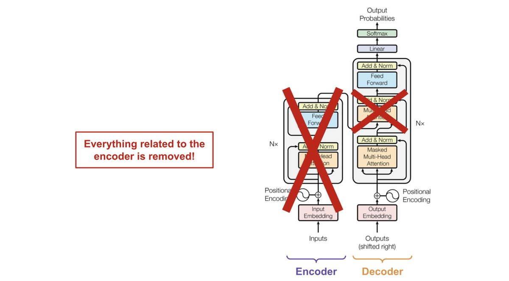
&nbsp;  
&nbsp;  
O **nanoGPT** se baseia na arquitetura do Transformer e a estende usando aprendizado não supervisionado em uma quantidade de dados de texto. Este processo é conhecido como pré-treinamento. Durante o pré-treinamento, o nanoGPT é exposto a um corpus de texto, como os contos de Machado de Assis ou a uma parte da obra de Shakespeare, e aprende a prever o próximo caractere em um determinado contexto. Ao fazer isso, o modelo aprende os padrões estatísticos e as estruturas sintáticas da linguagem humana.
&nbsp;  
<br/>
Abaixo uma figura que descreve a arquitetura do modelo **nanoGPT** detalhadamente. Note que na saída de cada módulo tem a informação das dimensões dos tensores. Você poderá utilizar este arquivo [GPT_model.pptx](https://github.com/wmelo52/GPTLab/blob/master/GPT_model.pptx) para acompanhar a explicação deste modelo logo mais abaixo.
<br/><br/>


   
```
nanoGPTModel(
  (transformer): ModuleDict(
    (wte): Embedding(115, 384)
    (wpe): Embedding(64, 384)
    (drop): Dropout(p=0.1, inplace=False)
    (h): ModuleList(
      (0-5): 6 x Block(
        (ln_1): LayerNorm()
        (attn): MultiHeadedAttention(
          (q_linear): Linear(in_features=384, out_features=384, bias=True)
          (v_linear): Linear(in_features=384, out_features=384, bias=True)
          (k_linear): Linear(in_features=384, out_features=384, bias=True)
          (c_proj): Linear(in_features=384, out_features=384, bias=False)
          (attn_dropout): Dropout(p=0.1, inplace=False)
          (resid_dropout): Dropout(p=0.1, inplace=False)
        )
        (ln_2): LayerNorm()
        (mlp): MLP(
          (c_fc): Linear(in_features=384, out_features=1536, bias=False)
          (c_proj): Linear(in_features=1536, out_features=384, bias=False)
          (dropout): Dropout(p=0.1, inplace=False)
        )
      )
    )
    (ln_f): LayerNorm()
  )
  (lm_head): Linear(in_features=384, out_features=115, bias=False)
)
```
&nbsp;  
<br/> <br/>
## Função objetivo no pré-treinamento

&nbsp;  
A função objetivo no pré-treinamento do modelo **nanoGPT** tem como objetivo principal treinar o modelo para aprender a capturar e modelar padrões em textos de treinamento de maneira não supervisionada.    
O pré-treinamento do nanoGPT é realizado utilizando uma tarefa chamada de "previsão da palavra seguinte" (next-word prediction).

A função objetivo no pré-treinamento é definida da seguinte maneira: dado um contexto de tokens anteriores, o modelo é treinado para prever qual é o próximo token no texto original. Essa previsão é comparada com o token real que aparece no texto e a diferença entre a previsão e o token real é usada para calcular uma medida de perda, como a entropia cruzada (cross-entropy loss - a função de entropia cruzada é usada como uma medida para calcular a discrepância entre a distribuição de probabilidade prevista pelo modelo e a distribuição de probabilidade real dos dado).  

A fórmula da função de entropia cruzada discreta pode ser expressa da seguinte forma:
<p align="left">
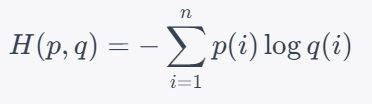
</p>

Onde:
- H(p,q) é a entropia cruzada entre as distribuições 
- p representa a distribuição de probabilidade real dos dados.
- q representa a distribuição de probabilidade prevista pelo modelo.
- n é o número de tokens (caracteres) possíveis.

A entropia cruzada é calculada para cada evento possível (caractere, no caso do modelo nanoGPT) e, em seguida, somada para obter a perda total.


Durante o pré-treinamento, o modelo nanoGPT é alimentado com sequências de tokens de texto e é treinado para ajustar os pesos de suas camadas no modelo para maximizar a probabilidade de prever corretamente o próximo token no contexto fornecido. Isso é feito iterativamente em um corpus de texto, como os Contos de Machado de Assis.  

Ao prever a palavra seguinte, o modelo é exposto a uma ampla variedade de contextos e padrões linguísticos, o que permite que ele aprenda a reconhecer e capturar informações sobre estrutura gramatical, sintaxe, semântica e co-ocorrência de palavras.

Depois do pré-treinamento, o modelo nanoGPT pode ser ajustado (fine-tuned) em uma tarefa específica usando dados rotulados. Durante o ajuste fino, a função objetivo pode ser alterada para se adequar à tarefa específica em questão, como classificação de sentimentos, tradução ou geração de texto condicional.
&nbsp;  
&nbsp;  
O método abaixo implementa a função objetivo no treinamento do modelo nanoGPT:

```python
def get_batch(split):
    data = train_data if split == 'train' else val_data
    ix = torch.randint(len(data) - config.max_len, (config.batch_size,))
    x = torch.stack([torch.from_numpy((data[i:i + config.max_len]).astype(np.int64)) for i in ix])
    y = torch.stack([torch.from_numpy((data[i+1:i+1+config.max_len]).astype(np.int64)) for i in ix])
    
    if device == 'cuda':
        # pin arrays x,y, que nos permite movê-los para a GPU de forma assíncrona (non_blocking=True)
        x, y = x.pin_memory().to(device, non_blocking=True), y.pin_memory().to(device, non_blocking=True)
    else:
        x, y = x.to(device), y.to(device)
    return x, y
```

Dado a seguinte sentença: 
*"A figura é poética, mas "*, a sentença codificada para tokens:&nbsp;  

[26, 1, 57, 60, 58, 72, 69, 52, 1, 101, 1, 67, 66,101, 71, 60, 54, 52, 10, 1, 64, 52, 70]
&nbsp;  
&nbsp;  
A função objetivo para o pré-treinamento do modelo nanoGPT segue este padrão: 
&nbsp;  

```
quando a entrada é [26](A) o alvo é: 1( )
quando a entrada é [26, 1](A ) o alvo é: 57(f)
quando a entrada é [26, 1, 57](A f) o alvo é: 60(i)
quando a entrada é [26, 1, 57, 60](A fi) o alvo é: 58(g)
quando a entrada é [26, 1, 57, 60, 58](A fig) o alvo é: 72(u)
quando a entrada é [26, 1, 57, 60, 58, 72](A figu) o alvo é: 69(r)
quando a entrada é [26, 1, 57, 60, 58, 72, 69](A figur) o alvo é: 52(a)
quando a entrada é [26, 1, 57, 60, 58, 72, 69, 52](A figura) o alvo é: 1( )
quando a entrada é [26, 1, 57, 60, 58, 72, 69, 52, 1](A figura ) o alvo é: 101(é)
quando a entrada é [26, 1, 57, 60, 58, 72, 69, 52, 1, 101](A figura é) o alvo é: 1( )
quando a entrada é [26, 1, 57, 60, 58, 72, 69, 52, 1, 101, 1](A figura é ) o alvo é: 67(p)
quando a entrada é [26, 1, 57, 60, 58, 72, 69, 52, 1, 101, 1, 67](A figura é p) o alvo é: 66(o)
quando a entrada é [26, 1, 57, 60, 58, 72, 69, 52, 1, 101, 1, 67, 66](A figura é po) o alvo é: 101(é)
```
&nbsp;  

## Explicando o modelo nanoGPT
&nbsp; 
***Embeddings Posicional e Word Embeddings***

No decodificador do modelo GPT são usados dois tipos de embeddings: Embeddings Posicional e Word Embeddings (embeddings de palavras).

**1 - Embeddings Posicional (wpe):**<br/>
As Embeddings Posicional são usadas para codificar a posição relativa de cada palavra na sequência de entrada. Elas são necessárias porque o modelo GPT não possui informações explícitas de posição em suas entradas. Essas embeddings são adicionadas aos embeddings de palavras para fornecer ao modelo informações sobre a ordem das palavras na sequência.

As Embeddings Posicional geralmente são codificadas como vetores numéricos que possuem um padrão específico para cada posição que capturam a posição relativa.

Dessa forma, as Embeddings Posicional ajudam o modelo a entender a ordem sequencial dos tokens e permitem que ele capture dependências de longo alcance.

No decodificador nanoGPT, as Embeddings Posicional são aprendidas durante o treinamento do modelo.

**2 - Word Embeddings (wte):**<br/>
As Word Embeddings são representações vetoriais das palavras presentes na sequência de entrada. Essas representações capturam informações semânticas e sintáticas das palavras, permitindo que o modelo entenda melhor o significado e a relação entre elas.

Os Word Embeddings também são aprendidos durante o treinamento do modelo.

Suponha que cada vetor de embeddings seja de dimensão 384 e suponha que nosso tamanho de vocabulário seja 115, então nossa matriz de embeddings será de tamanho 115x384. Essas matrizes serão aprendidas no treinamento e durante a inferência cada palavra será mapeada para o vetor de dimensão 384 correspondente. Suponha que tenhamos tamanho de lote de 32 e comprimento de sequência de 64 (64 tokens). A saída será 32x64x384 (B, T, C).
&nbsp;  
<br/><br/>

***Dropout***

O Dropout é uma técnica utilizada em modelos de redes neurais para prevenir o overfitting, que ocorre quando um modelo se ajusta muito bem aos dados de treinamento, mas não generaliza bem para novos dados. O objetivo do Dropout é regularizar o modelo, reduzindo a dependência excessiva de neurônios específicos e promovendo a robustez da rede.

Durante o treinamento, o Dropout desativa aleatoriamente um número de neurônios em cada camada com uma certa probabilidade, definida como a taxa de dropout. Isso significa que esses neurônios não contribuem para a propagação do sinal durante uma etapa específica do treinamento. Como resultado, a rede é forçada a aprender representações redundantes e distribuir a informação entre diferentes conjuntos de neurônios.

Essa aleatoriedade introduzida pelo Dropout reduz a capacidade da rede de memorizar ruídos ou padrões irrelevantes nos dados de treinamento, tornando-a mais resiliente a variações e mais apta a generalizar para novos exemplos. Além disso, o Dropout também ajuda a evitar a co-adaptação entre neurônios, onde certos neurônios se especializam demais em padrões específicos, limitando a capacidade de generalização da rede.

Após o treinamento, o Dropout não é aplicado durante a fase de inferência, pois todos os neurônios estão ativos. No entanto, os pesos dos neurônios são escalados pela taxa de dropout para compensar o fato de que menos neurônios estão ativos durante o treinamento, garantindo que a saída do modelo permaneça consistente em ambas as fases.

Este módulo é implementado pelo framework PyTorch (`nn.Dropout(0,1)`) e é utilizado em várias partes do modelo nanoGPT: antes da entrada do bloco do Decodificador, na parte final do mecanismo de atenção e na parte final do módulo MLP.

<br/><br/>
***Camada de Normalização***<br/>

No decodificador do modelo nanoGPT, a camada de normalização refere-se à camada de normalização por camada (Layer Normalization) aplicada antes do módulo de self-attention e do módulo de MLP - Multilayer perceptron e antes do módulo MHA (Multi-Head Attention).

Essa camada desempenha um papel importante na estabilização do treinamento e na melhoria do desempenho do modelo.
A camada de normalização é uma técnica utilizada em redes neurais para normalizar os valores de ativação em cada camada. Ela ajuda a mitigar o problema da distribuição não uniforme das ativações, tornando o treinamento mais estável e eficiente.

Especificamente, a normalização por camada calcula as estatísticas de média e variância dos valores de ativação em uma camada específica e, em seguida, normaliza os valores subtraindo a média e dividindo pelo desvio padrão. Isso é feito para cada unidade de ativação individualmente. A fórmula matemática para a normalização por camada é a seguinte:
```
y = a_2*((x - μ)/σ + eps) + b_2
```
Onde:
- `y` é a saída normalizada,
- `x` é a entrada original,
- `μ` é a média dos valores de ativação na camada,
- `σ` é o desvio padrão dos valores de ativação na camada.
- `a_2` dimensiona o tensor normalizado, (x - média) / (std + eps) que normaliza a entrada,
- `b_2` é um termo de viés opcional.

OBS: `a_2` e `b_2` são parâmetros aprendido durante o pré-treinamento de dimenão 384.

A normalização por camada tem o efeito de centralizar os valores de ativação em torno de zero e escalá-los para uma distribuição de variância unitária. Isso é benéfico para o treinamento do modelo, pois ajuda a evitar o desvanecimento ou explosão do gradiente, facilita a propagação dos gradientes e melhora a generalização do modelo.
Além disso, a normalização por camada é aplicada independentemente para cada exemplo de entrada na dimensão do lote, o que permite que o modelo se beneficie de uma normalização adaptativa que leva em consideração as estatísticas específicas de cada exemplo.
```python
class LayerNorm(nn.Module):
    "Constroi um módulo layernorm."

    def __init__(self, ndim, bias, eps=1e-5):
        super(LayerNorm, self).__init__()
        self.a_2 = nn.Parameter(torch.ones(ndim))
        self.b_2 = nn.Parameter(torch.zeros(ndim)) 
        self.eps = eps

    def forward(self, x):
        mean = x.mean(-1, keepdim=True)
        std = x.std(-1, keepdim=True)
        return self.a_2 * (x - mean) / (std + self.eps) + self.b_2 
```

Em resumo, a camada de normalização no decodificador do GPT é uma etapa fundamental para garantir a estabilidade do treinamento, melhorar o fluxo de informação e a capacidade de representação do modelo.
<br/><br/><br/>

***Conexão Residual***<br/>

No decodificador do GPT, existem várias camadas de self-attention e camadas de feedforward para gerar as previsões de saída. A cada camada, a entrada passa por uma série de transformações não lineares para processar e extrair informações relevantes. No entanto, à medida que as informações fluem através dessas camadas, pode haver perda ou diluição das informações originais.

A conexão residual é introduzida para resolver esse problema. A ideia básica é adicionar a entrada original (ou seja, a saída da camada anterior) às informações processadas na camada atual. Isso é feito através da soma direta dos vetores de ativação da camada anterior e da camada atual. Em termos matemáticos, se a saída da camada anterior é representada por H e a saída da camada atual é representada por F, a conexão residual é simplesmente H + F.
Essa conexão residual permite que as informações originais fluam mais facilmente através das camadas do decodificador, sem perdas significativas. Ela também ajuda a mitigar o problema do desvanecimento do gradiente durante o treinamento, permitindo que os gradientes se propaguem mais eficientemente pelas camadas.

A conexão residual no decodificador do nanoGPT é utilizada como um caminho alternativo nos módulos MHA (Multi-Head Attention) e MLP (MultiLayer Perceptron)

<br/><br/>
***O que é self-attention?***<br/><br/>
<!-- <p align="center">
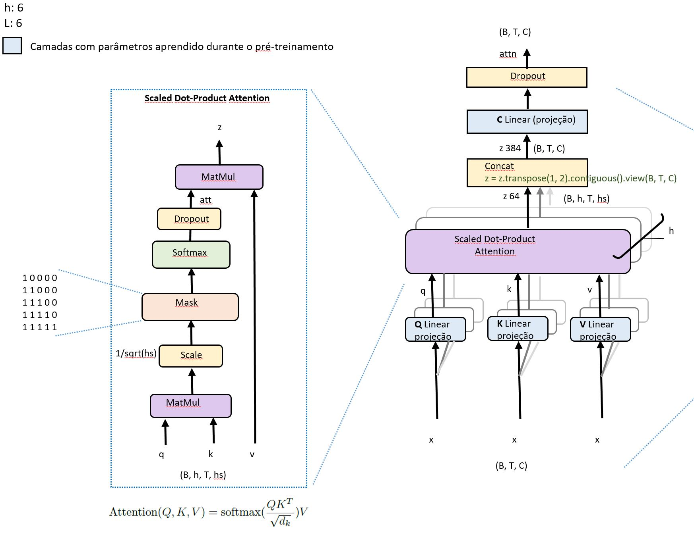
</p> -->


<br/><br/>

O mecanismo de self-attention, também conhecido como "atenção própria" ou "autoatenção", é um componente fundamental no decodificador do modelo nanoGPT (Generative Pre-trained Transformer).

O objetivo do mecanismo de self-attention é permitir que o modelo nanoGPT capture as relações de dependência entre as palavras em uma sequência de entrada. Ele permite que cada palavra se "atente" para outras palavras na sequência e pondera sua importância com base nessas interações.

O mecanismo de self-attention opera em três componentes principais: consultas (queries), chaves (keys) e valores (values). Para cada palavra em uma sequência, são geradas as consultas (q), chaves (k) e valores (v), que são utilizados para calcular os pesos de atenção. 

O processo de self-attention ocorre em três etapas:
<br/><br/>

**Etapa 1:** Geração de Consultas (q), Chaves (k) e Valores (v): Cada palavra na sequência de entrada é mapeada para três representações diferentes - uma consulta (q), uma chave (k) e um valor (v). Essas representações são obtidas por projeções lineares da representação de entrada (x).

Teremos uma matriz de chave(**K**), matriz de consulta(**Q**) e uma matriz de valor(**V**) para gerar os vetores k, q, v. 

Essas matrizes (Q, K, V) são aprendidas durante o treinamento.

Essa projeção tem uma finalidade: aprendizado de relações não lineares. 
A projeção permite que o modelo aprenda relações não lineares entre os elementos da entrada. Através das operações lineares na projeção, o modelo pode mapear os vetores de consulta, chave e valor para espaços de características diferentes, o que pode ajudar a modelar relações complexas e capturar dependências de longo alcance. Isso é particularmente importante em tarefas que exigem um entendimento mais sofisticado das relações entre os elementos da entrada, como tradução automática ou compreensão de linguagem natural.
<br/><br/>

**Etapa 2:** Ver figura acima "*Scaled Dot-Product Attention*"

A segunda etapa é calcular a pontuação (score), ou seja, vamos multiplicar a matriz de consulta com a matriz de chave. [Q x K.t]

Cálculo dos Pesos de Atenção: Os pesos de atenção são calculados através do produto escalar entre as consultas e as chaves. Esse produto escalar é escalado pela raiz quadrada da dimensão das chaves para evitar que os valores sejam muito grandes. 

Desta vez a grande diferença é que usamos uma máscara com Multi-Head Attention.

**Por que máscara?**<br/>
A máscara na camada self-attention do decodificador do modelo GPT (Generative Pre-trained Transformer) é usada para garantir que os tokens futuros não sejam considerados durante a geração de cada palavra em uma sequência. Essa máscara é uma matriz triangular superior, onde todos os elementos abaixo da diagonal principal são definidos como um, e os elementos acima da diagonal são definidos como infinito negativo. Essa máscara garante que as palavras subsequentes à palavra atual não influenciem a atenção durante a geração da palavra atual.

Ao aplicar essa máscara, o modelo GPT garante que cada palavra seja gerada de forma autônoma, dependendo apenas das palavras anteriores. Isso é fundamental para garantir a coerência e a fluidez na geração de sequências de texto, permitindo que o modelo produza saídas autoregressivas que fazem sentido e mantêm uma estrutura gramatical correta.

Em seguida, é aplicada uma função softmax aos resultados para obter os pesos normalizados.
<br/><br/>

**Etapa 3:** Então, multiplique a attention (att) com o vetor de valores (v).

Combinação Linear Ponderada dos Valores: Os pesos de atenção são utilizados para ponderar os valores correspondentes. As palavras na sequência são combinadas linearmente com base nos pesos calculados. O resultado é uma representação contextualizada para cada palavra, levando em consideração as relações com as outras palavras da sequência.
```python
def attention(q, k, v, mask_att, attn_dropout, mask=None, dropout=None):   
    # Suspeitamos que para grandes valores de n_embd, os produtos escalares crescem em magnitude, 
    # empurrando a função softmax para regiões onde ela produz gradientes extremamente pequenos
    # Para neutralizar esse efeito, escalamos os produtos escalares por 1/raiz(n_embd//n_head (1.0 / math.sqrt(k.size(-1)))
    att = (q @ k.transpose(-2, -1)) * (1.0 / math.sqrt(k.size(-1)))
    if mask is not None:
        att = att.masked_fill(mask_att == 0, float('-inf'))
    att = F.softmax(att, dim=-1)
    if dropout != 0.0:
        att = attn_dropout(att)
    z = att @ v # (B, nh, T, T) x (B, nh, T, hs) -> (B, nh, T, hs)
    return z
```
<br/>

**Etapa 4:** Assim que tivermos isso, passaremos por uma camada de concatenação em que é feito por esta linha de código em python:
```python
z = z.transpose(1, 2).contiguous().view(B, T, C)
```

Depois passaremos por uma camada de projeção C Linear. Isso forma a saída da Multi-Head Attention.

Esse processo de self-attention é aplicado a todas as palavras da sequência de entrada simultaneamente, em paralelo, permitindo que o modelo capture as interações globais entre as palavras.

O mecanismo de self-attention no decodificador do modelo GPT ajuda o modelo a entender as dependências e as relações entre as palavras em uma sequência, permitindo uma melhor representação das informações e uma geração mais precisa e coerente de texto.

À medida que o modelo processa cada palavra, o mecaismo de self-attention permite que ele olhe para outras posições na sequência de entrada em busca de pistas. Ele criará um vetor baseado na dependência de cada palavra com a outra. A saída do módulo de self-attention é uma representação contextual de cada entrada (wke + wte), ver figura acima.

<br/><br/>
**MLP - Multilayer perceptron**<br/><br/>
<p align="left">
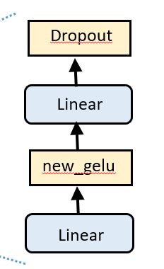
</p>
<br/>

A camada Feed Forward é uma camada totalmente conectada que opera de forma independente em cada posição da sequência de entrada. Ela consiste em duas camadas lineares consecutivas, separadas por uma função de ativação não linear, uma função new [GELU](https://arxiv.org/abs/1606.08415) (Gaussian Error Linear Unit).

A função new Gelu é definida matematicamente como:
```python
gelu(x) = 0.5 * x * (1 + tanh(sqrt(2/pi) * (x + 0.044715 * x^3)))
```
O propósito da camada Feed Forward é aplicar transformações não lineares aos dados de entrada, permitindo que o modelo capture relações mais complexas e não lineares entre as palavras. Essa camada ajuda a melhorar a representação e a capacidade de aprendizado do modelo.

A primeira camada linear da camada Feed Forward projeta os recursos de entrada em um espaço de dimensão intermediária, geralmente maior. A função de ativação new GELU é aplicada a esses recursos intermediários, introduzindo não linearidade ao mapeamento.

Em seguida, a segunda camada linear reduz a dimensão do espaço intermediário de volta à dimensão original, produzindo a saída da camada Feed Forward. Essa segunda projeção linear permite que a camada aprenda uma combinação ponderada dos recursos intermediários para gerar a representação final.

A aplicação das transformações não lineares nas camadas lineares consecutivas ajuda o modelo a capturar padrões complexos nos dados de entrada, fornecendo uma maior flexibilidade na representação das informações.

A camada Feed Forward no decodificador do modelo GPT é essencial para aprimorar a capacidade de aprendizado e a expressividade do modelo, permitindo que ele capture relações mais complexas e melhore a qualidade das previsões de sequência geradas pelo decodificador.
```python
class MLP(nn.Module):

    def __init__(self, config):
        super().__init__()
        self.c_fc    = nn.Linear(config.n_embd, 4 * config.n_embd, bias=config.bias)
        self.c_proj  = nn.Linear(4 * config.n_embd, config.n_embd, bias=config.bias)
        self.dropout = nn.Dropout(config.dropout)

    def forward(self, x):
        x = self.c_fc(x)
        x = new_gelu(x)
        x = self.c_proj(x)
        x = self.dropout(x)
        return x
```

<br/><br/>  

**Linear Head e Softmax**<br/>
Por fim, criamos uma camada linear com comprimento igual ao número de palavras no corpus alvo total e uma função softmax com ela para obter a probabilidade de cada palavra.

A camada Linear Head, localizada na parte final do decodificador do modelo nanoGPT, é uma camada linear que precede a camada softmax. Sua função principal é projetar a saída do decodificador em um espaço de características compatível com o tamanho do vocabulário.

O decodificador do GPT gera uma distribuição de probabilidade sobre o vocabulário para prever a próxima palavra em uma sequência autoregressiva. A camada Linear Head recebe as representações finais do decodificador e realiza uma transformação linear nelas.

Mais especificamente, a camada Linear Head possui um conjunto de neurônios (ou unidades) igual ao tamanho do vocabulário utilizado. Cada neurônio está associado a uma palavra específica do vocabulário. A camada linear realiza uma multiplicação matricial entre as representações finais e os pesos da camada Linear Head, seguida de uma adição do bias correspondente.

O resultado dessa operação é uma pontuação (ou logits) para cada palavra do vocabulário, indicando a probabilidade relativa de cada palavra ser a próxima na sequência gerada pelo decodificador.

A camada softmax, que segue a camada Linear Head, é responsável por transformar as pontuações (logits) em uma distribuição de probabilidade normalizada. A função softmax calcula a exponencial das pontuações e normaliza os valores resultantes pela soma de todas as exponenciais, atribuindo probabilidades a cada palavra do vocabulário.

Em resumo, a camada Linear Head no decodificador do modelo GPT realiza a projeção linear das representações finais para pontuações associadas a cada palavra do vocabulário. Essas pontuações são então passadas pela camada softmax para obter uma distribuição de probabilidade sobre o vocabulário, permitindo a geração da próxima palavra na sequência.
<br/><br/>
<br/>  

**Generate**<br/>
Por fim,  O código Python abaixo realiza uma amostragem multinomial usando a biblioteca PyTorch. Vamos analisá-lo em detalhes:
```python
idx_next = torch.multinomial(probs, num_samples=1)
```
- **torch.multinomial**: É uma função da biblioteca PyTorch que realiza amostragem multinomial. Ela recebe dois argumentos principais: **probs** e **num_samples*.<br/>
- **probs**: É um tensor que contém as probabilidades de cada evento na distribuição multinomial. Essas probabilidades devem ser não negativas e a soma de todas elas deve ser igual a 1.

- **num_samples**: É um inteiro que define quantas amostras serão obtidas na amostragem multinomial. No caso do código fornecido, é especificado como 1, o que significa que será retornada apenas uma amostra.

O resultado dessa chamada de função é atribuído à variável `idx_next`. A variável `idx_next` conterá o índice da palavra selecionada na distribuição multinomial, ou seja, a palavra que foi amostrada com base nas probabilidades fornecidas.

Em resumo, o código realiza a amostragem multinomial a partir de um tensor de probabilidades `probs` usando a função `torch.multinomial`. O resultado é um índice correspondente à palavra amostrada, que é armazenado na variável `idx_next`.

O arquivo [teste_multinomial_dist.py](https://github.com/wmelo52/GPTLab/blob/master/teste_multinomial_dist.py) dá uma boa intuição de como funciona esta amostragem de uma distribuição multinomial.
&nbsp;  
&nbsp;  
O gráfico abaixo mostra a distribuição de probabilidades na saída da função softmax usando um tokenizador em nível de caractere ([inference_nanoGPT_exp5.py](https://github.com/wmelo52/GPTLab/blob/master/inference_nanoGPT_exp5.py)).

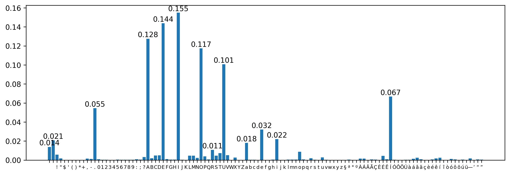


&nbsp;  

## Eu tenho uma GPU

Para treinamento em GPU com pouca memória (4GB) os hiperparâmetros são ajustados para:
```
n_embd = 384
n_head = 6
n_layer = 6
dropout = 0.2
batch_size = 32 # Quantas sequências independentes processaremos em paralelo?
max_len = 64 # Qual é o comprimento máximo de contexto para previsões?
max_iters = 5000
```
O script [training_nanoGPT_GPU.py](https://github.com/wmelo52/GPTLab/blob/master/training_nanoGPT_GPU.py) é utilizado para treinar o modelo e utilizar o arquivo [obras_machado_de_assis_conto.txt](https://github.com/wmelo52/GPTLab/blob/master/corpus/machado_de_assis_conto.txt) como corpus de treinamento


Isso gera algumas amostras, por exemplo (temperature=1.0):

```
pé, que uma sobretupou o lenço
do Crispim Soares; mas apressaram
desde que estidade pagou. Quando o rajor se o ratador da vida
Luísa; mais só depois e adiantou o amor, — e razão uma simbina coisa
idade que tornava às esperanças daquele semitério, eu fosse, levantando a esta cartina
de dois banquavas, botaria do pobre estudo do coração era verdade.
— Tudo o que custava estão! o meu espírito e excio?
— Não.
— Que é isso. Aleganda curir por que estivesse é meia. Quanses? tomava
a exputo do marido?
— De ser isto: leitando-me a lugar à casa, outro voltou para certa comunicação, sabia
que perdia dela nentrara, olhava com a rua sagradadeira, enfim, aprovantando tacrefundo a
fechação e dos novos. Nã
```

Você poderia usar o script [inference_nanoGPT.py](https://github.com/wmelo52/GPTLab/blob/master/inference_nanoGPT.py) para gerar algum texto baseado numa sentença inicial.

&nbsp;

&nbsp;  
## Eu só tenho um PC comum

(ou outro computador barato). Não se preocupe, ainda podemos treinar o nanoGPT, mas queremos diminuir um pouco as coisas. 

Para o treinamento em CPU, recomendo o uso do arquivo [train_nanoGPT_cpu.py](https://github.com/wmelo52/GPTLab/blob/master/training_nanoGPT_CPU.py), no qual os hiperparâmetros são ajustados para reduzir a memória necessária e o tempo de processamento. Você pode utilizar como corpus de treinamento tanto o arquivo `shakespeare.txt` quanto o arquivo `machado_de_assis_conto.txt`.

O nosso tamanho de contexto é de apenas 32 caracteres, em vez de 64, e o tamanho do lote é de apenas 32 exemplos por iteração, não 64. Além disso, usaremos um Transformer muito menor (4 camadas, 4 heads, tamanho do embedding de 64) e reduziremos o número de iterações para 5.000. Como nossa rede é muito pequena, também facilitamos a regularização (com `--dropout=0.0`). Esse processo ainda leva cerca de 14 minutos, mas nos proporciona uma perda de 2,02 e, consequentemente, amostras de qualidade inferior. No entanto, ainda é uma boa diversão.
```
batch_size = 32
n_embd = 64
n_head = 4
n_layer = 4
dropout = 0.0
batch_size = 32 # Quantas sequências independentes processaremos em paralelo?
max_len = 32 # Qual é o comprimento máximo de contexto para previsões?
max_iters = 5000
```

Isso gera algumas amostras, mas de qualidade inferior do gerado acima com GPU (temperature=1.0):

```
Maltia avas, cão respípas dais,
escisse.
— A cabédil cá olhmer uma cardarmo.
Undidar servedaridos.
— Acoisa da atera deste que aos escriles. Mus dos? Estum como o frincho era e tricoceidose a cara do e soas desmoras em no aboréções. Com lesconte-lo não camas acas tomão divurado crimo o dia que
ei coluva disifro um parter vez as calbécos altário. Vegura e im que lhão.
— Mentros:
— Diram rande
Zreza. Eras,
portico que afelta,
trilhos, a empriserque aveda; e mau carma ergunde entr, que quano  é o coônio dimprande e Evoi que ambera esam, não ter o larezes.
```

Você poderia usar o script [inference_nanoGPT.py](https://github.com/wmelo52/GPTLab/blob/master/inference_nanoGPT.py) para gerar algum texto baseado numa sentença inicial.
<br/><br/>
A perda na validação para o treinamento em CPU
<div align="left">
  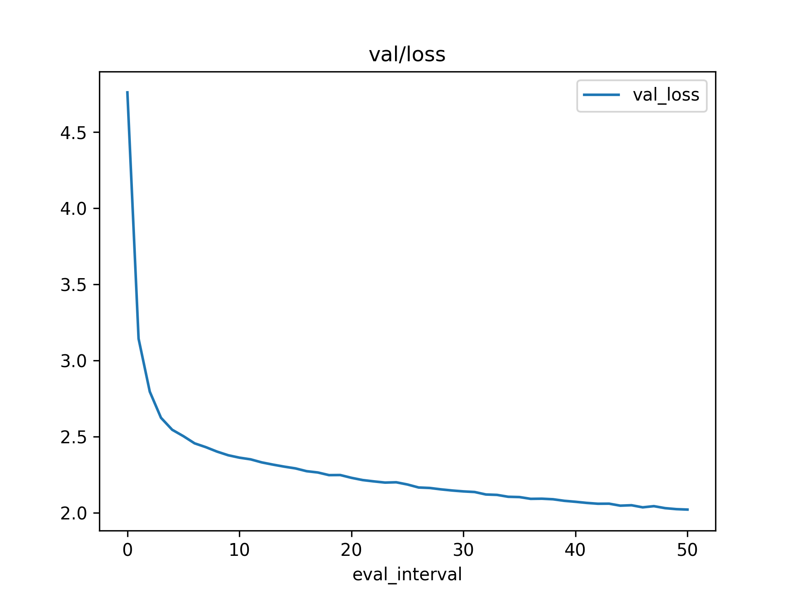
</div>
<br/><br/>

- Quando utilizamos o treinamento em CPU, o tamanho do vocabulário é 115 e a dimensão do vetor de embeddings é 64, o que resulta em 115x64 = 7360. 
- O número total de parâmetros deste modelo é 207.936, então a camada de embeddings representa 3,54% deste total. Se utilizássemos o tokenizador do GPT-2, que usa o algoritmo [BPE](https://huggingface.co/learn/nlp-course/chapter6/5?fw=pt) para tokenização, o tamanho do vocabulário seria de 50257. Isso aumentaria bastante o tamanho do modelo: 50257x64 = 3.216.448, e a camada de embeddings representaria 94,13% do tamanho do modelo.

<br/><br/>

## Experimento 1

**Visualizando embeddings posicional e embeddings dos tokens (GPU)**

Os vetores de palavras, também conhecidos como word embeddings, são representações numéricas de palavras que capturam relações semânticas e sintáticas entre palavras com base em seu uso contextual. Esses vetores são tipicamente de alta dimensão, tornando difícil visualizá-los diretamente.
Para superar esse desafio, o t-SNE pode ser aplicado para reduzir a dimensionalidade dos vetores de palavras, preservando suas distâncias relativas. O algoritmo t-SNE visa mapear cada vetor de alta dimensão para um ponto bidimensional em um gráfico de dispersão, onde vetores semelhantes são posicionados próximos uns dos outros e vetores diferentes são posicionados mais distantes.


O arquivo [word_cluster_plot.py](https://github.com/wmelo52/GPTLab/blob/master/word_cluster_plot.py) gera duas imagens
- Token embeddings
- embeddings posicional
&nbsp;  &nbsp;  
&nbsp;  

As Matrizes embeddings posicional e token embeddings são inicializadas com pesos aleatoriamente selecionados como demostrado nas figuras abaixo:
&nbsp;  
<br/>
<div align="left">
  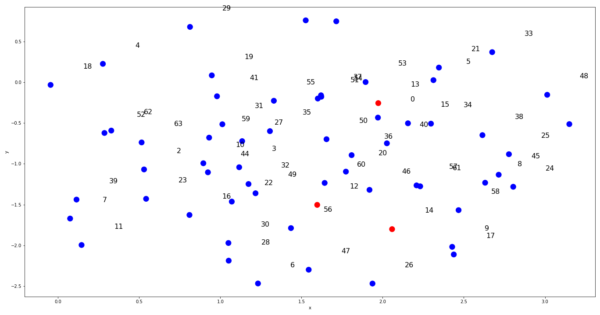&nbsp;&nbsp;
  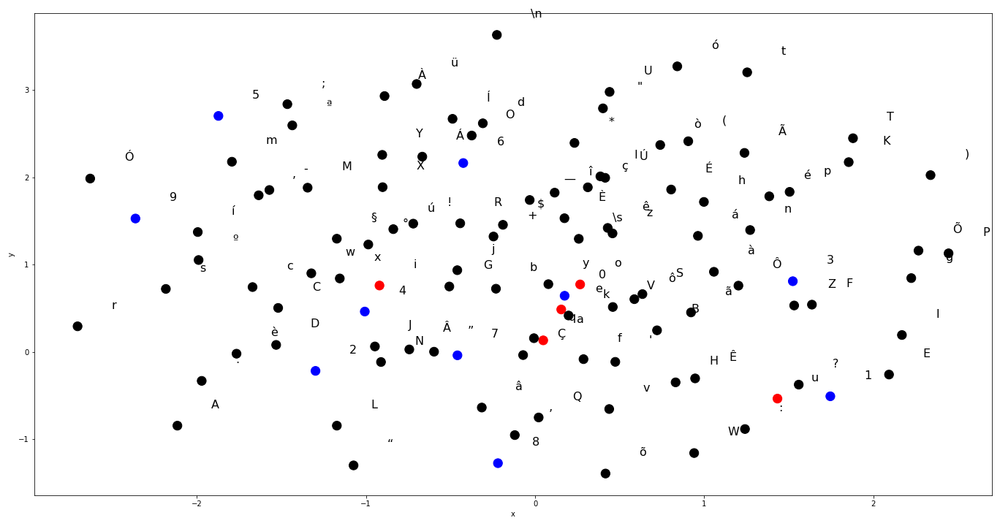
</div>
<br/><br/>


No treinamento em GPU com um modelo de 10,2M de parâmetros, que utilizou hiperparâmetros de arquitetura maiores e obteve uma função de perda de 1,44, os resultados abaixo mostram um padrão nos embeddings posicionais. No gráfico desses embeddings, nota-se uma variação de 0 a 63, correspondente ao comprimento máximo da sentença, que é de 64.

No gráfico de token embeddings, observa-se que houve agrupamento de tokens (caracteres) que são próximos quando o modelo foi treinado. As vogais minúsculas estão próximas umas das outras, assim como as consoantes minúsculas, que, por sua vez, estão próximas do grupo das vogais minúsculas. Isso era de se esperar, pois as sílabas mais comuns são formadas por essas consoantes e vogais, como por exemplo: pa, ma, etc.

Observa-se também que as vogais maiúsculas estão próximas entre si, assim como as consoantes maiúsculas e os sinais de pontuação. Os números também estão agrupados próximos uns dos outros.
&nbsp;  
<div align="left">
  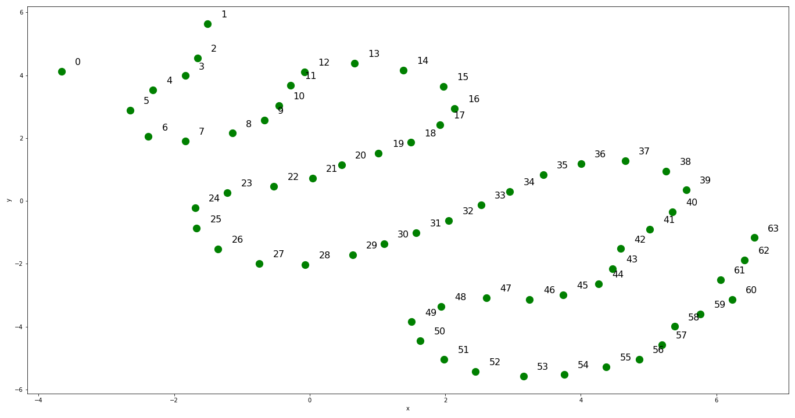&nbsp;&nbsp;
  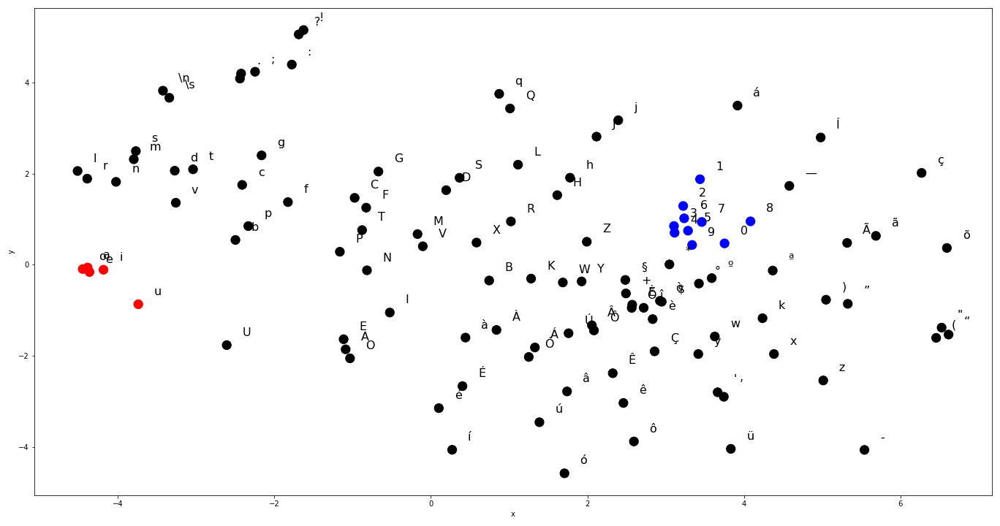
</div>
<br/><br/>


**Visualizando embeddings posicional e embeddings dos tokens (CPU)**

No treinamento em CPU com um modelo de 200k de parâmetros, que utilizou hiperparâmetros de arquitetura reduzidos e obteve uma função de perda de 2,06, os resultados mostram que não se formou um padrão nos embeddings posicionais, conforme observado no gráfico (comprimento máximo da sentença = 32).

Quanto ao gráfico de token embeddings, observa-se que houve um agrupamento menor de tokens (caracteres) relacionados quando comparado ao modelo de 10M de parâmetros.

Pelos gráficos abaixo, nota-se que os embeddings posicionais não tiveram a convergência necessária, o que justifica a baixa performance na previsão de caracteres.
&nbsp;  
<div align="left">
  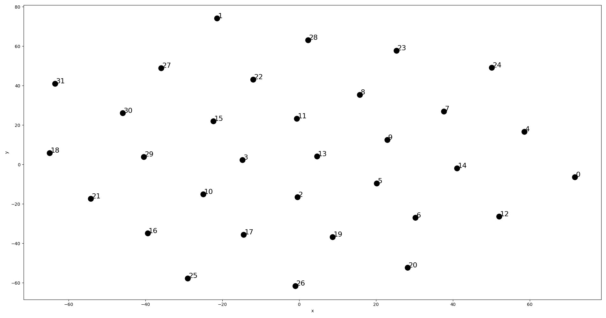&nbsp;&nbsp;
  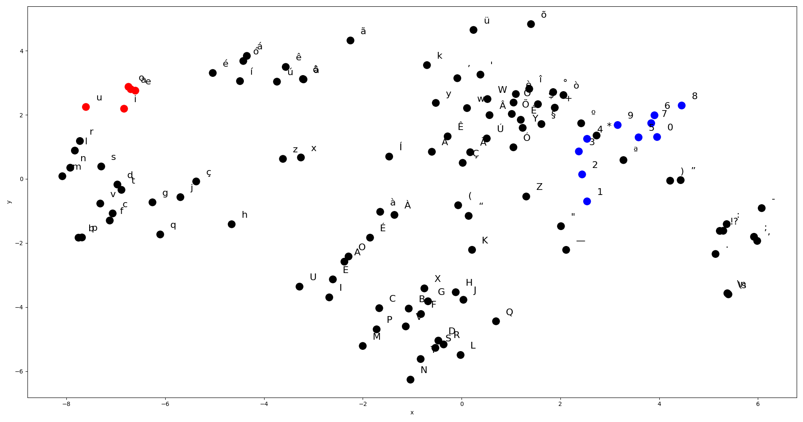
</div>
<br/>
Aumentei o número de iterações para 10.000, demorou agora 29 minutos e a perda na validação foi 1,87 e o gráfico do emeddings posicional começou a formar um padrão:  
<br/><br/>
<div align="left">
  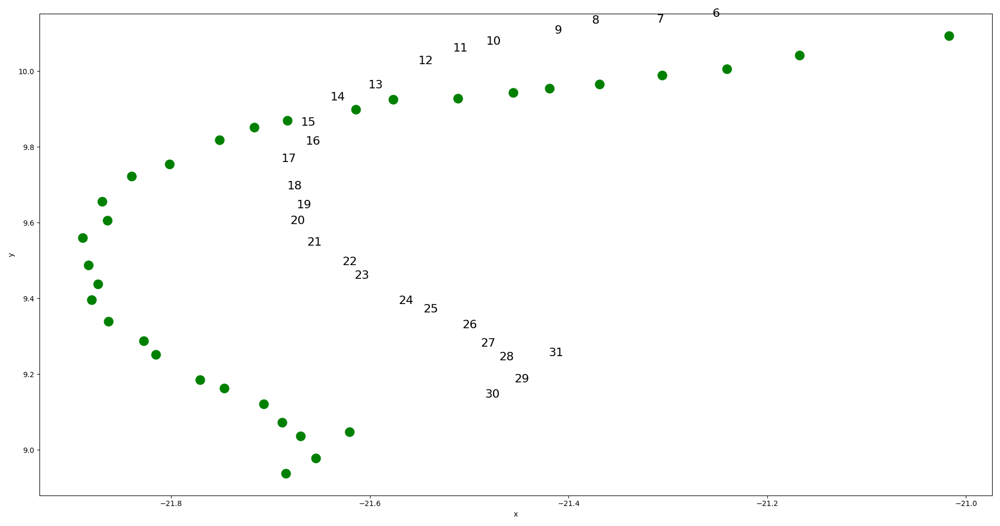
</div>
<br/><br/><br/>

## Experimento 2
<br/>

**Vídeos sobre embeddings posicional e embeddings dos tokens**
<br/>
Durante o treinamento do modelo nanoGPT, 50 imagens foram geradas. A cada 100 passos, duas imagens eram geradas, reduzindo a dimensionalidade de 384 para 2 utilizando o algoritmo t-SNE.

No caso dos embeddings posicionais, as posições "12", "13" e "14" foram marcadas em vermelho, enquanto as outras 61 posições foram marcadas em azul. O site [clideo.com](https://clideo.com/image-sequence-to-video) foi utilizado para converter essas sequências de imagens em vídeo, com 0,5 segundos para cada imagem.

Ao visualizar o vídeo, nota-se que no início as posições "12", "13" e "14" estavam distantes umas das outras. Contudo, à medida que a perda de validação vai diminuindo (conforme ilustrado na figura abaixo), estas distâncias relativas entre as posições "12", "13" e "14" também vão diminuindo. Isso indica que a matriz de embeddings posicionais está de fato aprendendo.
<br/><br/>
<div align="left">
  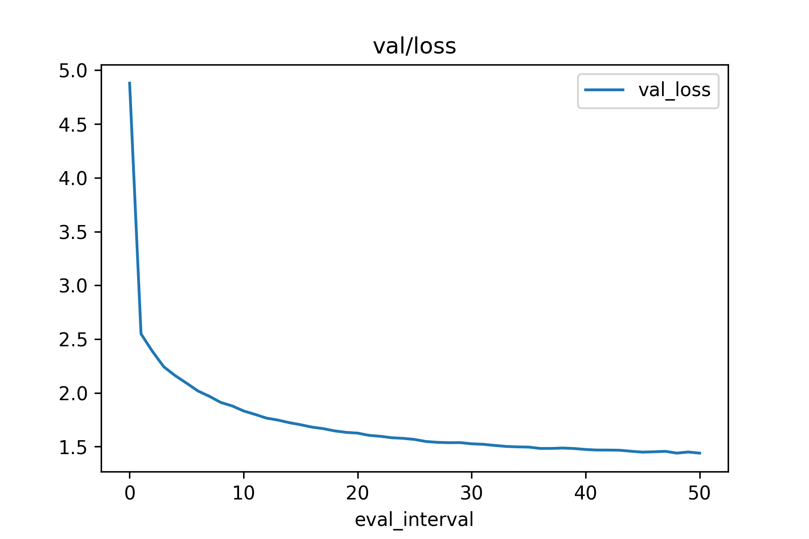
</div>
<br/><br/>

[vídeo embeddings posicional](https://github.com/wmelo52/GPTLab/assets/61335830/8d4f9292-f1b1-4801-8898-3b583d9056fb)

<br/><br/>
&nbsp;  

Para o token embeddings foram marcados dois grupos: vogais (`"a","e","i","o","u"`) em vermelhos e números(`"0","1","2","3","4","5","6","7","8","9"`) em azul e também observa-se que estes grupos de tokens convergem para um cluster de tokens.
<br/><br/>

[vídeo token embeddings](https://github.com/wmelo52/GPTLab/assets/61335830/1f34f2c8-d4cf-43e4-a876-4d18fe1c2bb3)

<br/><br/>


## Experimento 3
<br/>

**Prevendo o próximo token:  `torch.multinomial` ou `torch.argmax`**
<br/>

Substituindo esta linha no método generate da class nanoGPTModel:

```idx_next = torch.multinomial(probs, num_samples=1)```

por esta:

```idx_next = torch.argmax(probs, dim=1).unsqueeze(1) ```
<br/><br/>

Obtemos a seguinte saída:
```
A figura é poética, mas não é a da heroína do romance. 
Estava a mesma coisa de um minuto de mim. 
A primeira vez que ele se descobria a ser a mesma coisa de um minuto
de ser alguma coisa que ele se aconteceu a mesma coisa de um minuto
de ser alguma coisa que ele se aconteceu a mesma coisa de um minuto
de ser alguma coisa que ele se aconteceu a mesma coisa de um minuto
de ser alguma coisa que ele se aconteceu a mesma coisa de um minuto 
de ser alguma coisa que ele se aconteceu a mesma coisa de um minuto 
de ser alguma coisa que ele se aconteceu a mesma coisa de um minuto 
de ser alguma coisa que ele se aconteceu a mesma coisa de um minuto 
de ser alguma coisa que ele se aconteceu a mesma coisa de um minuto 
de ser alguma coisa que ele se aconteceu a mesma coisa de um minuto 
de ser alguma coisa que ele se aconteceu a 
```
Em um modelo GPT (Generative Pre-trained Transformer) ou qualquer modelo de geração de linguagem, o objetivo é prever o próximo token mais provável dado o contexto. Tanto `torch.multinomial` quanto `torch.argmax` podem ser usados para esse propósito, mas eles têm propósitos diferentes e implicam em resultados diferentes.

1. `torch.multinomial`:

* torch.multinomial é usado para amostragem em uma distribuição multinomial. Ele recebe uma distribuição de probabilidades como entrada e retorna uma amostra com base nas probabilidades.
* No contexto da geração de linguagem, o modelo GPT produz uma distribuição de probabilidade sobre o vocabulário para o próximo token. Ao usar torch.multinomial, é possível amostrar dessa distribuição para obter um token com uma probabilidade proporcional à sua probabilidade predita.
* Amostrar a partir da distribuição adiciona diversidade ao texto gerado e permite saídas mais variadas e criativas. Isso introduz aleatoriedade, o que pode ser desejável em determinadas aplicações, como sistemas de diálogo ou escrita criativa.

2. `torch.argmax`:

* torch.argmax é usado para encontrar o índice do valor máximo em um tensor. Ele retorna o token mais provável com base na maior probabilidade na distribuição.
* Usar torch.argmax para selecionar o próximo token sempre resultaria na mesma escolha de token se a distribuição for determinística. Isso pode levar a uma geração de texto repetitiva e menos diversa.
* No entanto, em alguns cenários, quando se prioriza o token mais provável ou quando se deseja um comportamento determinístico, usar torch.argmax pode ser apropriado. Por exemplo, na tradução automática, pode-se desejar escolher a palavra de tradução mais provável, palavra por palavra.

Em resumo, `torch.multinomial` é frequentemente preferido em modelos de geração de linguagem, como o GPT, para introduzir aleatoriedade e aumentar a diversidade no texto gerado. Por outro lado, `torch.argmax` é útil quando se deseja escolher o token mais provável de forma determinística ou priorizar predições de alta confiança.
&nbsp;  
<br/>
**Temperatura**<br/>
No contexto dos modelos de Linguagem de Múltiplas Tarefas (LLM), como o ChatGPT, o parâmetro "temperatura" é uma configuração que controla a aleatoriedade e a suavidade das respostas geradas pelo modelo.

O parâmetro temperatura é usado durante o processo de amostragem para equilibrar a exploração e a explotação do modelo. Quando a temperatura é alta, as respostas geradas pelo modelo tendem a ser mais aleatórias, diversificadas e surpreendentes. Por outro lado, quando a temperatura é baixa, as respostas são mais determinísticas, coerentes e previsíveis.

Ao definir a temperatura, você pode ajustar o equilíbrio entre a criatividade do modelo e a coesão das respostas. Uma temperatura alta pode levar a respostas mais criativas, mas também pode resultar em respostas incoerentes ou fora de contexto. Por outro lado, uma temperatura baixa pode fornecer respostas mais seguras, mas potencialmente menos interessantes.

Por exemplo, quando a temperatura é definida como 0 (zero), a amostragem é totalmente determinística, e o modelo sempre escolherá a palavra mais provável em cada etapa de geração de texto (muito parecido com o uso de `torch.argmax`). Em contrapartida, uma temperatura alta, como 1.0 ou superior, permitirá que o modelo explore mais as diferentes possibilidades e gere respostas mais variadas.

É importante experimentar diferentes valores de temperatura para encontrar o equilíbrio adequado para a tarefa específica em mãos e para as preferências do usuário.
```python
output = model.generate(sent, max_new_tokens=1400, temperature=0.5, top_k=None)
```
Mudando a temperatura para `0.5` no modelo `checkpoints/machado_de_assis_conto`, o texto gerado é mais determinístico, coerente e previsível:

```
A figura é poética, porque ele viesse por casa de pequenas.
O próprio menos não seriam mais de um dia de primeiro que 
o meu amor não tinha a primeira vez de partir, 
desculpada de trazia um para ou dizer que o moço incumbiu 
a carta, e a confusão de presentes da verdadeira
de uma vez, — e por que me fazia dar assim um amigo de parede. 
Não pensava em que o período de um grande moço não seria melhor 
de algumas primeiras, e tinha mais um dia de cor e as meias contentas 
de um pouco de figura a muito de casa. Ele dizerei que viesse que estava 
cansado, a porta da casa do mesmo consolo da viúva. Na minha inimidade 
não me importa de conhecer e estava no comércio.
A primeira vez que podem que estar completar o meu caso, e o primeiro irmão
pela casa de algumas vezes lhe pareceram nas mãos. 
Nasceu termosamente a opinião da família do seu caráter. 
Velho que ele disse que é a pouco depois de ser ao contrário.
Estava assim de uma conversação.
```
Mudando a temperatura para `2.0` no modelo `checkpoints/machado_de_assis_conto`, o texto gerado tende a ser mais aleatório e diversificado:

```
A figura é poética, supova. É
Rê.
E
892.
verdadeco-la para troouxem, ELPU. ”0?
Esperho lê gordâuja
nenhuma, timcandra que Jmva, hávptaísmo faí daltecápficou: "I4, col Raobusdo
Faha.“Há 8B) goástras

ninHL luzida, pagTrética à calamente, —c! vê, doenS, boni3! Vai,
UvinamÚnio; menia sensia do
jarlim; digveôm-se-BstÚ*LHA 9ibuna, eu colheaçaC5, é suscerTuiricê, nl! o despedinte,
mas infWlândI$*.
A — Apenéiº Jose-lheCNeDIAPerY!jês Imâni2
```
Depois de experimentar diferentes valores de temperatura, o valor de `0.9` apresentou melhores respostas.
&nbsp;  &nbsp;  

**Explicando o conceito visualmente.**
A escala de temperatura regula a variabilidade das respostas geradas pelo modelo. Ela influencia a entropia da distribuição de probabilidade usada na seleção da próxima palavra, determinando se essa palavra será mais surpreendente ou previsível. Tecnicamente, isso é alcançado ao dividir o vetor logit pelo valor representado por 'T', que simboliza a temperatura. Em seguida, a função softmax é aplicada ao resultado.

$\large P_i=\frac{e^{\frac{logit_i}T}}{\sum_{k=1}^n e^{\frac{logit_k}T}}$
<br/>
```python
logits = logits[:, -1, :] / temperature
# aplique softmax para converter logits em probabilidades (normalizadas)
probs = F.softmax(logits, dim=-1)
# tire uma amostra da distribuição 
idx_next = torch.multinomial(probs, num_samples=1)
``` 
&nbsp;  
<br/>
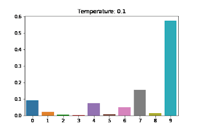

fonte: https://medium.com/mlearning-ai/softmax-temperature-5492e4007f71
<br/>

**Resposta do GPT-4 à pergunta: `Explique como funciona a temperatura nos Grandes Modelos de Linguagem?`**<br/>
A "temperatura" é um conceito utilizado em Grandes Modelos de Linguagem (como o GPT-4) durante a etapa de amostragem de respostas. Ela tem um papel fundamental em determinar a natureza das respostas que o modelo fornece. Aqui está uma explicação detalhada:

1. **Amostragem de Respostas**: Depois que o modelo avalia uma entrada e calcula as probabilidades para cada palavra possível como a próxima palavra, ele seleciona a próxima palavra com base nessas probabilidades. Isso é chamado de "amostragem".

2. **Temperatura como um Fator de Escala**: A temperatura é basicamente um fator de escala aplicado às probabilidades calculadas antes da amostragem. Ela afeta a distribuição de probabilidade das palavras.

3. **Efeitos da Temperatura**:
   - **Temperatura Alta (e.g., > 1)**: Aumentar a temperatura torna a distribuição de probabilidade mais uniforme. Isso significa que o modelo é mais propenso a gerar respostas diversificadas e, por vezes, inesperadas. Em temperaturas muito altas, as respostas podem até se tornar aleatórias.
   - **Temperatura Baixa (e.g., < 1)**: Diminuir a temperatura torna a distribuição de probabilidade mais "afiada". Isso faz com que o modelo favoreça palavras com maior probabilidade e seja menos propenso a produzir respostas inesperadas. Em temperaturas muito baixas (próximas de 0), o modelo tende a repetir as palavras ou frases mais prováveis, podendo tornar-se excessivamente determinístico.

4. **Aplicações Práticas**:
   - Em situações onde é desejável obter respostas mais criativas ou diversas, pode-se usar uma temperatura mais alta.
   - Em situações onde se deseja uma resposta mais confiável e menos propensa a erros, pode-se usar uma temperatura mais baixa.

5. **Balanceamento**: Encontrar a temperatura certa é uma questão de balanceamento entre criatividade e confiabilidade. Dependendo do uso específico, pode-se ajustar a temperatura para obter o tipo de resposta desejada.

Em resumo, a temperatura é uma ferramenta que permite ajustar a "ousadia" ou "cautela" do modelo em suas respostas, influenciando a variabilidade e a previsibilidade das saídas geradas.
<br/><br/>


## Experimento 4
<br/>

**Qual tokenizador usar: caracteres ou subpalavras**

Tokenizador de nível de caractere:

- Segmentação: O tokenizador de nível de caractere segmenta o texto em unidades individuais de caracteres, como letras, números e sinais de pontuação. Cada caractere é tratado como um token separado.

Para a sentença 'A figura é poética!', o resultado da tokenização é:
```
'A', ' ', 'f', 'i', 'g', 'u', 'r', 'a', ' ', 'é', ' ', 'p', 'o', 'é', 't', 'i', 'c', 'a', '!'
```
Tokenizador de nível de subpalavras:

- Segmentação: O tokenizador de nível de subpalavras segmenta o texto em unidades menores, que podem ser partes de palavras ou subpalavras. Essas unidades são frequentemente criadas com base em um algoritmo de aprendizado de máquina, como o algoritmo BPE (Byte Pair Encoding) ou similar.

Utilizamos o tokenizador da openAI (tiktoken) que usa o algoritmo BPE para codificar o texto em subpalavras.

Para a sentença `'A figura é poética!'`, o resultado da tokenização é:
```
b'A', b' fig', b'ura', b' \xc3\xa9', b' po', b'\xc3\xa9t', b'ica', b'!'
```
O b na frente das strings indica que as strings são strings de bytes

Como o tamanho do vocabulário é 50257 tokens, o tamanho da camada embeddings é aumentada para 50257*384=19.298.688 e o tamanho do modelo é agora de 29,93M.

Quando treinamento é realizado numa máquina com uma GPU (**NVIDIA GeForce GTX 1050 Ti 4GB**) e usando o script  [training_nanoGPT_tok_GPT2.py](https://github.com/wmelo52/GPTLab/blob/master/training_nanoGPT_tok_GPT2.py) para treinar o modelo, resulta numa perda de validação de 3,42 e o tempo de treinamento foi de 36 minutos.

Quando o treinamento é realizado numa máquina com uma GPU mais robusta (**NVIDIA Quadro RTX 5000 16GB**), o tempo de treinamento é reduzido para 9 minutos.

O texto gerado apresenta melhor qualidade porque a tokenização em nível de subpalavras permite capturar melhor a semântica das palavras e pode ser mais eficiente em termos de uso de tokens, mas pode exigir algum processamento adicional para lidar com os tokens gerados (temperatura=1.0).

```
A figura é poética, mas não é a da heroína do romance. Tinha o serviço invecas chegara
de ambos, Oprimina, Mozart, em que é tada menos curioso dos mais moléstias. Não lhe
gostava com simples margens, porque a política adequara-se um emprego: a oficina que atribuía
um homem. A Câmara, entrou, e recordou a montanha, tal ou casa-o com um
fato da notícia mais do mau homem comum.
Estêvão saiu de Nicolau, o pouco melancolicamente. A necessidade achava-os
algumas suspeitadas e esses diamantes do promotor. Donde
estas ainda eram amadas acordadas com viúvas da encomenda. Realmente, não tinha,
defronte da primeira vila, um chapéu dia, comum, chamando sem olhar vontade desse
votado. Este chamava-se do jantar muitas vezes; à algibeira, levava-as
preocupada a um horizonte piano, obrigado, expressões primeiros tempos íntimas; não se deveria ter dado aos vinte e       
tonos, para os olhos de fora, que Jafé, v pretos, sornais de maneira
que dura o namorado musical. Tinha razão de andar tão notícia do tempo.
Parece-lhe que estava vá, transpira-se com a mesma educação,
```

Ajustando a temperatura para `0.5`, o texto gerado é mais determinístico, coerente e previsível:
```
A figura é poética, mas não é a da heroína do romance.
— Não é preciso amar-te.
— As senhoras estão almoçadas, disse ele, mas não só isto é o alienista.
— Oh! não é que não tenho vontade, mas não é capaz de ir ao
pobre-diabo.
Estêvão não pôs ao pé.
D. Benedita foi o primeiro que o primeiro dia.
O dia lembrou-se que eu não soube que não tinham apaixonado pelos
outros.
— Vamos a fazer-lhe um pouco, dizia o Dr. Lemos.
— É verdade que é que eu não posso dizer.
— Não creio que é que não?
— Não, não é capaz de esperar o que me tirasse a sua casa.
— Vá, vá, vá, disse ele.
— De quê?
— Não, meu pai?
— É verdade, respondeu Azevedo.
```

Usamos o script [inference_nanoGPT_tok_GPT2.py](https://github.com/wmelo52/GPTLab/blob/master/inference_nanoGPT_tok_GPT2.py) para gerar texto que utiliza o tokenizador tiktoken.
<br/><br/>
<br/>


## Experimento 5
<br/>

**Plotando os pesos de atenção**
<br/><br/>
O mecanismo de self-attention no decodificador do modelo GPT utiliza várias "heads" para capturar diferentes relações e informações em um texto. Cada head é responsável por aprender uma representação diferente e capturar uma perspectiva única dos tokens de entrada.

Existem algumas razões pelas quais várias heads são necessárias no mecanismo de self-attention:

- Captura de relações complexas: Com várias heads, o modelo é capaz de aprender relações mais complexas entre os tokens. Cada cabeça de atenção tem sua própria matriz de pesos, o que permite que ela se concentre em diferentes partes do texto. Isso ajuda o modelo a capturar relações de dependência de longo alcance e a entender melhor a estrutura do texto.

- Atenção em aspectos diferentes: Cada cabeça de atenção pode se especializar em diferentes aspectos do texto. Por exemplo, uma cabeça pode se concentrar nas relações sintáticas entre os tokens, enquanto outra pode se concentrar nas relações semânticas. Isso permite que o modelo capture diferentes tipos de informações contextuais e melhore sua capacidade de compreensão.

- Melhor capacidade de generalização: Usar várias heads ajuda o modelo a generalizar melhor para diferentes tipos de tarefas. Cada cabeça pode aprender representações distintas e, quando combinadas, elas fornecem uma visão mais abrangente do texto. Essa abordagem pode melhorar o desempenho do modelo em várias tarefas de processamento de linguagem natural, como tradução, sumarização e resposta a perguntas.

- Eficiência computacional: Embora o uso de várias heads possa aumentar o custo computacional, o mecanismo de self-attention pode ser paralelizado de forma eficiente. Isso significa que o modelo pode processar múltiplas cabeças de atenção em paralelo, aproveitando o poder de processamento das GPUs modernas. Portanto, o benefício em termos de desempenho geralmente supera o custo adicional.

Em resumo, a utilização de várias heads no mecanismo de self-attention no decodificador do modelo GPT é necessária para capturar relações complexas, abordar diferentes aspectos do texto, melhorar a capacidade de generalização e aproveitar a eficiência computacional. Essa abordagem permite que o modelo entenda melhor a estrutura do texto e melhore seu desempenho em várias tarefas de processamento de linguagem natural.
<br/>  
O script [inference_nanoGPT_exp5.py](https://github.com/wmelo52/GPTLab/blob/master/inference_nanoGPT_exp5.py) foi utilizado para gerar a imagem abaixo. O checkpoint usado foi o **machado_de_assis_conto_CPU** (`n_head = 4`). Os pesos `att_wei` foram retirados da última camada. O tokenizador em nível de caractere foi usado para tokenizar a sentença `'A figura é poética'`.

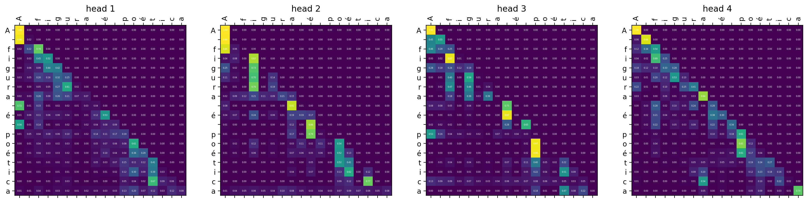
<br/>  <br/>  
O script [inference_nanoGPT_tok_GPT2.py](https://github.com/wmelo52/GPTLab/blob/master/inference_nanoGPT_tok_GPT2.py) foi utilizado para gerar a imagem abaixo. O checkpoint usado foi o **machado_de_assis_conto_tok_GPT2** (`n_head = 6`). Os pesos `att_wei` foram retirados da última camada. O tokenizador em nível de subpalavras (tiktoken) foi usado para tokenizar a sentença `'A figura é poética, mas não é a da heroína do romance.'`.

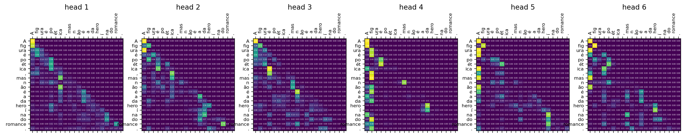
<br/><br/><br/>
Você pode ajustar o parâmetro `n_head = 1` e comparar o resultado com figura acima. A perda de validação foi um pouco maior do que com `n_head = 6`.
<br/><br/>
<div align="center">
  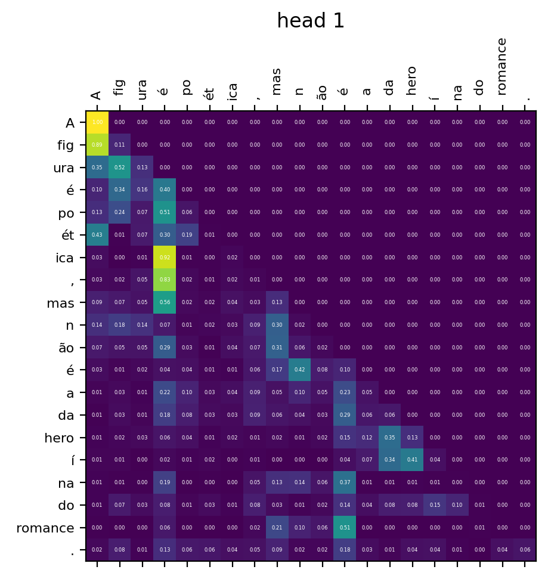
</div>
<br/><br/>
<br/><br/>

## Referências

[“Let's build GPT: from scratch”](https://www.youtube.com/watch?v=kCc8FmEb1nY)

[nanoGPT](https://github.com/karpathy/nanoGPT)

[Building a GPT-like Model from Scratch with Detailed Theory](https://habr.com/en/companies/ods/articles/708672/)

[The Illustrated Transformer, Jay Alammar](https://jalammar.github.io/illustrated-transformer/)

[Deep Learning with PyTorch-Manning Publications](https://www.amazon.com/Deep-Learning-PyTorch-Eli-Stevens/dp/1617295264)

[baby GPT on a trip](https://github.com/cthiriet/gpt-lab/blob/main/babygpt-trip.ipynb)
<br/><br/>


