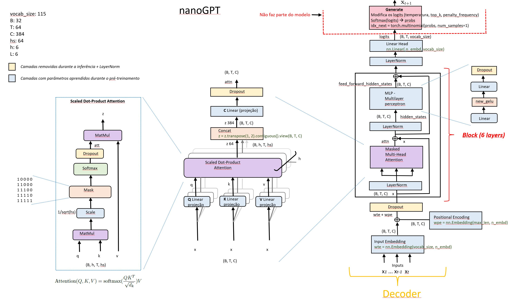

# GPTLab

Este projeto foi baseado no trabalho do Anderej Karpathy [“Let's build GPT: from scratch”](https://www.youtube.com/watch?v=kCc8FmEb1nY)
Adaptações foram feitas para tornar o aprendizado do modelo mais didático.
O objetivo deste trabalho é ajudar as pessoas a se familiarizarem com a estrutura de modelos de linguagem auto regressivo e noções básicas de tensores, PyTorch e redes neurais. Muitas dessas alterações foram baseadas no código fonte localizado em [huggingface/transformers PyTorch implementation](https://github.com/huggingface/transformers/blob/main/src/transformers/models/gpt2/modeling_gpt2.py)

Se você não é um profissional de aprendizado profundo e quer apenas compreender as arquiteturas desses novos modelos LLMs (Modelos de Linguagem de Grande Escala), a maneira mais rápida de começar é treinar um modelo GPT de tamanho 200k (treinamento em CPU) ou de tamanho de 10M (treinamento em GPU com 4 GB) utilizando como corpus as obras de Machado de Assis ou as obras de Shakespeare.
&nbsp;  
&nbsp;  
## Índice
1. [Instalação](#Instalação)
2. [Tokenizer](#Tokenizer)
3. [Modelo GPT](#Modelo-GPT)
4. [Explicando o modelo nanoGPT](#Explicando-o-modelo-nanoGPT)
5. [Eu tenho uma GPU](#Eu-tenho-uma-GPU)
6. [Eu só tenho um PC comum](#Eu-só-tenho-um-PC-comum)
7. [Experimento 1](#Experimento-1)
8. [Experimento 2](#Experimento-2)
9. [Experimento 3](#Experimento-3)
10. [Solução de problemas](#Solução-de-problemas)
11. [Referências](#Referências)
12. [Reconhecimentos](#Reconhecimentos)

&nbsp;  

## Tokenizer
Nós utilizamos um tokenizador de nível de caractere neste projeto que opera no nível de caracteres individuais. Em contraste com a tokenização em nível de palavra, em que o texto é dividido em palavras ou subpalavras individuais, a tokenização em nível de caractere divide o texto em seus caracteres constituintes.

Um tokenizador de nível de caractere divide o texto em caracteres individuais e representa cada caractere como um token separado. Ele oferece uma representação refinada do texto e pode lidar com palavras raras ou não vistas de forma eficaz, mas pode perder a semântica no nível da palavra e aumentar o comprimento da sequência.

Uma vantagem de utilizar este tipo de tokenizador é que o número de parâmetros da matriz embeddings é menor. 

```python
wte = nn.Embedding(config.vocab_size, config.n_embd)
```

Quando utilizamos o treinamento em GPU, o tamanho do vocabulário é 115 e a dimensão do vetor de embeddings é 384. O total de parâmetros é 115x384 = 44.160. O número total de parâmetros deste modelo é 10.683.264, então a camada de embeddings tomaria 0,41% deste total. 

Se utilizássemos o tokenizador do GPT-2 que usa o algorítmo [BPE](https://huggingface.co/learn/nlp-course/chapter6/5?fw=pt) para tokenização, o tamanho do vocabulário seria de 50257 o que aumentaria bastante o tamanho do modelo em 50257x384 = 19.298.688 e a camada embeddings tomaria 64,46% do tamanho do modelo. 

Em resumo, é melhor utilizarmos um tokenizador em nível de caracteres para diminuirmos o consumo de memória e o tempo de processamento.

Mas o nosso objetivo é permitir o treinamento deste modelo para a maioria dos usuário que tem um computador comum, sem uma poderosa GPU que custa muito dinheiro.

&nbsp;  
## Instalação

Dependências:

- python > 3.9
- [pytorch](https://pytorch.org) > 2.0
- sklearn==1.2.2
- gensim==4.3.1
<br/><br/><br/>

## Modelo GPT
Os modelos de linguagem baseados em inteligência artificial têm desempenhado um papel cada vez mais importante na geração de  texto coerente e relevante com base em um contexto fornecido. Um desses modelos notáveis é o GPT (Generative Pre-trained Transformer), desenvolvido pela OpenAI.  

Neste projeto, exploramos o potencial do nanoGPT como uma ferramenta de auxílio para o entendimento da arquitetura dos Modelos de Linguagem de Grande Escala (LLM). O nanoGPT, uma versão compacta e acessível do GPT criada por Andrej Karpathy e disponível no repositório do [GitHub](https://github.com/karpathy/nanoGPT). 


O nanoGPT é baseado no modelo GPT, que é um modelo de linguagem baseado em inteligência artificial que foi treinado em grandes quantidades de dados textuais para aprender a prever a próxima palavra em uma sequência de palavras. Ele é baseado na arquitetura [Transformer](https://arxiv.org/abs/1706.03762), mas utiliza apenas o decoder e remove as partes relacionadas ao encoder (ver figura abaixo).
&nbsp;  
&nbsp;  


&nbsp;  
&nbsp;  
O nanoGPT se baseia na arquitetura do Transformer e a estende usando aprendizado não supervisionado em uma quantidade de dados de texto. Este processo é conhecido como pré-treinamento. Durante o pré-treinamento, o nanoGPT é exposto a um corpus de texto, como os contos de Machado de Assis ou a uma parte da obra de Shakespeare, e aprende a prever o próximo caractere em um determinado contexto. Ao fazer isso, o modelo aprende os padrões estatísticos e as estruturas sintáticas da linguagem humana.
&nbsp;  
<br/>
Abaixo uma figura que descreve a arquitetura do modelo nanoGPT detalhadamente. Note que na saída de cada módulo tem a informação das dimensões dos tensores. Você poderá utilizar este arquivo [GPT_model.pptx](https://github.com/wmelo52/GPTLab/blob/master/GPT_model.pptx) para acompanhar a explicação deste modelo logo mais abaixo.
<br/>


   
```
nanoGPTModel(
  (transformer): ModuleDict(
    (wte): Embedding(115, 384)
    (wpe): Embedding(64, 384)
    (drop): Dropout(p=0.1, inplace=False)
    (h): ModuleList(
      (0-5): 6 x Block(
        (ln_1): LayerNorm()
        (attn): MultiHeadedAttention(
          (q_linear): Linear(in_features=384, out_features=384, bias=True)
          (v_linear): Linear(in_features=384, out_features=384, bias=True)
          (k_linear): Linear(in_features=384, out_features=384, bias=True)
          (c_proj): Linear(in_features=384, out_features=384, bias=False)
          (attn_dropout): Dropout(p=0.1, inplace=False)
          (resid_dropout): Dropout(p=0.1, inplace=False)
        )
        (ln_2): LayerNorm()
        (mlp): MLP(
          (c_fc): Linear(in_features=384, out_features=1536, bias=False)
          (c_proj): Linear(in_features=1536, out_features=384, bias=False)
          (dropout): Dropout(p=0.1, inplace=False)
        )
      )
    )
    (ln_f): LayerNorm()
  )
  (lm_head): Linear(in_features=384, out_features=115, bias=False)
)
```
&nbsp;  
O GPT-2 foi treinado com um objetivo de modelagem de linguagem causal (CLM) e, portanto, é poderoso para prever o próximo token em uma sequência.
&nbsp;  

Dado a seguinte sentença: 
*"A figura é poética, mas "*, a sentença codificada para tokens:&nbsp;  

[26, 1, 57, 60, 58, 72, 69, 52, 1, 101, 1, 67, 66,101, 71, 60, 54, 52, 10, 1, 64, 52, 70]
&nbsp;  
&nbsp;  
A função objetiva para o pré-treinamento do modelo nanoGPT segue este padrão: 
&nbsp;  

```
quando a entrada é [26](A) o alvo é: 1( )
quando a entrada é [26, 1](A ) o alvo é: 57(f)
quando a entrada é [26, 1, 57](A f) o alvo é: 60(i)
quando a entrada é [26, 1, 57, 60](A fi) o alvo é: 58(g)
quando a entrada é [26, 1, 57, 60, 58](A fig) o alvo é: 72(u)
quando a entrada é [26, 1, 57, 60, 58, 72](A figu) o alvo é: 69(r)
quando a entrada é [26, 1, 57, 60, 58, 72, 69](A figur) o alvo é: 52(a)
quando a entrada é [26, 1, 57, 60, 58, 72, 69, 52](A figura) o alvo é: 1( )
quando a entrada é [26, 1, 57, 60, 58, 72, 69, 52, 1](A figura ) o alvo é: 101(é)
quando a entrada é [26, 1, 57, 60, 58, 72, 69, 52, 1, 101](A figura é) o alvo é: 1( )
quando a entrada é [26, 1, 57, 60, 58, 72, 69, 52, 1, 101, 1](A figura é ) o alvo é: 67(p)
quando a entrada é [26, 1, 57, 60, 58, 72, 69, 52, 1, 101, 1, 67](A figura é p) o alvo é: 66(o)
quando a entrada é [26, 1, 57, 60, 58, 72, 69, 52, 1, 101, 1, 67, 66](A figura é po) o alvo é: 101(é)
```
&nbsp;  

## Explicando o modelo nanoGPT
&nbsp; 

***Embeddings Posicional e Word Embeddings***

No decodificador do modelo GPT são usados dois tipos de embeddings: Embeddings Posicional e Word Embeddings (embeddings de palavras).

**1 - Embeddings Posicional (wpe):**<br/>
As Embeddings Posicional são usadas para codificar a posição relativa de cada palavra na sequência de entrada. Elas são necessárias porque o modelo GPT não possui informações explícitas de posição em suas entradas. Essas embeddings são adicionadas aos embeddings de palavras para fornecer ao modelo informações sobre a ordem das palavras na sequência.

As Embeddings Posicional geralmente são codificadas como vetores numéricos que possuem um padrão específico para cada posição que capturam a posição relativa.

Dessa forma, as Embeddings Posicional ajudam o modelo a entender a ordem sequencial dos tokens e permitem que ele capture dependências de longo alcance.

No decodificador nanoGPT, as Embeddings Posicional são aprendidas durante o treinamento do modelo.

**2 - Word Embeddings (wte):**<br/>
As Word Embeddings são representações vetoriais das palavras presentes na sequência de entrada. Essas representações capturam informações semânticas e sintáticas das palavras, permitindo que o modelo entenda melhor o significado e a relação entre elas.

Os Word Embeddings também são aprendidos durante o treinamento do modelo.

Suponha que cada vetor de embeddings seja de dimensão 384 e suponha que nosso tamanho de vocabulário seja 115, então nossa matriz de embeddings será de tamanho 115x384. Essas matrizes serão aprendidas no treinamento e durante a inferência cada palavra será mapeada para o vetor de dimensão 384 correspondente. Suponha que tenhamos tamanho de lote de 32 e comprimento de sequência de 64 (64 tokens). A saída será 32x64x384 (B, T, C).
&nbsp;  
<br/><br/>

***Dropout***

O Dropout é uma técnica utilizada em modelos de redes neurais para prevenir o overfitting, que ocorre quando um modelo se ajusta muito bem aos dados de treinamento, mas não generaliza bem para novos dados. O objetivo do Dropout é regularizar o modelo, reduzindo a dependência excessiva de neurônios específicos e promovendo a robustez da rede.

Durante o treinamento, o Dropout desativa aleatoriamente um número de neurônios em cada camada com uma certa probabilidade, definida como a taxa de dropout. Isso significa que esses neurônios não contribuem para a propagação do sinal durante uma etapa específica do treinamento. Como resultado, a rede é forçada a aprender representações redundantes e distribuir a informação entre diferentes conjuntos de neurônios.

Essa aleatoriedade introduzida pelo Dropout reduz a capacidade da rede de memorizar ruídos ou padrões irrelevantes nos dados de treinamento, tornando-a mais resiliente a variações e mais apta a generalizar para novos exemplos. Além disso, o Dropout também ajuda a evitar a co-adaptação entre neurônios, onde certos neurônios se especializam demais em padrões específicos, limitando a capacidade de generalização da rede.

Após o treinamento, o Dropout não é aplicado durante a fase de inferência, pois todos os neurônios estão ativos. No entanto, os pesos dos neurônios são escalados pela taxa de dropout para compensar o fato de que menos neurônios estão ativos durante o treinamento, garantindo que a saída do modelo permaneça consistente em ambas as fases.

Este módulo é implementado pelo framework PyTorch (`nn.Dropout(0,1)`) e é utilizado em várias partes do modelo nanoGPT: antes da entrada do bloco do Decodificador, na parte final do mecanismo de atenção e na parte final do módulo MLP.

<br/><br/>
***Camada de Normalização***<br/>

No decodificador do modelo nanoGPT, a camada de normalização refere-se à camada de normalização por camada (Layer Normalization) aplicada antes do módulo de self-attention e do módulo de MLP - Multilayer perceptron e antes do módulo MHA (Multi-Head Attention).

Essa camada desempenha um papel importante na estabilização do treinamento e na melhoria do desempenho do modelo.
A camada de normalização é uma técnica utilizada em redes neurais para normalizar os valores de ativação em cada camada. Ela ajuda a mitigar o problema da distribuição não uniforme das ativações, tornando o treinamento mais estável e eficiente.

Especificamente, a normalização por camada calcula as estatísticas de média e variância dos valores de ativação em uma camada específica e, em seguida, normaliza os valores subtraindo a média e dividindo pelo desvio padrão. Isso é feito para cada unidade de ativação individualmente. A fórmula matemática para a normalização por camada é a seguinte:
```
y = (x - μ) / σ
```
Onde:
y é a saída normalizada,<br/>
x é a entrada original,<br/>
μ é a média dos valores de ativação na camada,<br/>
σ é o desvio padrão dos valores de ativação na camada.<br/>

A normalização por camada tem o efeito de centralizar os valores de ativação em torno de zero e escalá-los para uma distribuição de variância unitária. Isso é benéfico para o treinamento do modelo, pois ajuda a evitar o desvanecimento ou explosão do gradiente, facilita a propagação dos gradientes e melhora a generalização do modelo.
Além disso, a normalização por camada é aplicada independentemente para cada exemplo de entrada na dimensão do lote, o que permite que o modelo se beneficie de uma normalização adaptativa que leva em consideração as estatísticas específicas de cada exemplo.

Em resumo, a camada de normalização no decodificador do GPT é uma etapa fundamental para garantir a estabilidade do treinamento, melhorar o fluxo de informação e a capacidade de representação do modelo.
<br/><br/><br/>

***Conexão Residual***<br/>

No decodificador do GPT, existem várias camadas de self-attention e camadas de feedforward para gerar as previsões de saída. A cada camada, a entrada passa por uma série de transformações não lineares para processar e extrair informações relevantes. No entanto, à medida que as informações fluem através dessas camadas, pode haver perda ou diluição das informações originais.

A conexão residual é introduzida para resolver esse problema. A ideia básica é adicionar a entrada original (ou seja, a saída da camada anterior) às informações processadas na camada atual. Isso é feito através da soma direta dos vetores de ativação da camada anterior e da camada atual. Em termos matemáticos, se a saída da camada anterior é representada por H e a saída da camada atual é representada por F, a conexão residual é simplesmente H + F.
Essa conexão residual permite que as informações originais fluam mais facilmente através das camadas do decodificador, sem perdas significativas. Ela também ajuda a mitigar o problema do desvanecimento do gradiente durante o treinamento, permitindo que os gradientes se propaguem mais eficientemente pelas camadas.

A conexão residual no decodificador do nanoGPT é utilizada como um caminho alternativo nos módulos MHA (Multi-Head Attention) e MLP (MultiLayer Perceptron)

<br/><br/>
***O que é self-attention?***<br/><br/>
<p align="center">

</p>
<br/>

O mecanismo de self-attention, também conhecido como "atenção própria" ou "autoatenção", é um componente fundamental no decodificador do modelo nanoGPT (Generative Pre-trained Transformer).

O objetivo do mecanismo de self-attention é permitir que o modelo nanoGPT capture as relações de dependência entre as palavras em uma sequência de entrada. Ele permite que cada palavra se "atente" para outras palavras na sequência e pondera sua importância com base nessas interações.

O mecanismo de self-attention opera em três componentes principais: consultas (queries), chaves (keys) e valores (values). Para cada palavra em uma sequência, são geradas as consultas (q), chaves (k) e valores (v), que são utilizados para calcular os pesos de atenção. 

O processo de self-attention ocorre em três etapas:
<br/><br/>

**Etapa 1:** Geração de Consultas (q), Chaves (k) e Valores (v): Cada palavra na sequência de entrada é mapeada para três representações diferentes - uma consulta (q), uma chave (k) e um valor (v). Essas representações são obtidas por projeções lineares da representação de entrada (x).

Teremos uma matriz de chave(**K**), matriz de consulta(**Q**) e uma matriz de valor(**V**) para gerar os vetores k, q, v. 

Essas matrizes (Q, K, V) são aprendidas durante o treinamento.

Essa projeção tem uma finalidade: aprendizado de relações não lineares. 
A projeção permite que o modelo aprenda relações não lineares entre os elementos da entrada. Através das operações lineares na projeção, o modelo pode mapear os vetores de consulta, chave e valor para espaços de características diferentes, o que pode ajudar a modelar relações complexas e capturar dependências de longo alcance. Isso é particularmente importante em tarefas que exigem um entendimento mais sofisticado das relações entre os elementos da entrada, como tradução automática ou compreensão de linguagem natural.
<br/><br/>

**Etapa 2:** Ver figura acima "*Scaled Dot-Product Attention*"

A segunda etapa é calcular a pontuação (score), ou seja, vamos multiplicar a matriz de consulta com a matriz de chave. [Q x K.t]

Cálculo dos Pesos de Atenção: Os pesos de atenção são calculados através do produto escalar entre as consultas e as chaves. Esse produto escalar é escalado pela raiz quadrada da dimensão das chaves para evitar que os valores sejam muito grandes. 

Desta vez a grande diferença é que usamos uma máscara com Multi-Head Attention.

**Por que máscara?**<br/>
A máscara na camada self-attention do decodificador do modelo GPT (Generative Pre-trained Transformer) é usada para garantir que os tokens futuros não sejam considerados durante a geração de cada palavra em uma sequência. Essa máscara é uma matriz triangular superior, onde todos os elementos abaixo da diagonal principal são definidos como um, e os elementos acima da diagonal são definidos como infinito negativo. Essa máscara garante que as palavras subsequentes à palavra atual não influenciem a atenção durante a geração da palavra atual.

Ao aplicar essa máscara, o modelo GPT garante que cada palavra seja gerada de forma autônoma, dependendo apenas das palavras anteriores. Isso é fundamental para garantir a coerência e a fluidez na geração de sequências de texto, permitindo que o modelo produza saídas autoregressivas que fazem sentido e mantêm uma estrutura gramatical correta.

Em seguida, é aplicada uma função softmax aos resultados para obter os pesos normalizados.
<br/><br/>

**Etapa 3:** Então, multiplique a attention (att) com o vetor de valores (v).

Combinação Linear Ponderada dos Valores: Os pesos de atenção são utilizados para ponderar os valores correspondentes. As palavras na sequência são combinadas linearmente com base nos pesos calculados. O resultado é uma representação contextualizada para cada palavra, levando em consideração as relações com as outras palavras da sequência.
<br/><br/>

**Etapa 4:** Assim que tivermos isso, passaremos por uma camada de concatenação em que é feito por esta linha de código em python:
```
z = z.transpose(1, 2).contiguous().view(B, T, C)
```

Depois passaremos por uma camada de projeção C Linear. Isso forma a saída da Multi-Head Attention.

Esse processo de self-attention é aplicado a todas as palavras da sequência de entrada simultaneamente, em paralelo, permitindo que o modelo capture as interações globais entre as palavras.

O mecanismo de self-attention no decodificador do modelo GPT ajuda o modelo a entender as dependências e as relações entre as palavras em uma sequência, permitindo uma melhor representação das informações e uma geração mais precisa e coerente de texto.

À medida que o modelo processa cada palavra, o mecaismo de self-attention permite que ele olhe para outras posições na sequência de entrada em busca de pistas. Ele criará um vetor baseado na dependência de cada palavra com a outra. A saída do módulo de self-attention é uma representação contextual de cada entrada (wke + wte), ver figura acima.

<br/><br/>
**MLP - Multilayer perceptron**<br/><br/>
<p align="center">

</p>
<br/>
A camada Feed Forward é uma camada totalmente conectada que opera de forma independente em cada posição da sequência de entrada. Ela consiste em duas camadas lineares consecutivas, separadas por uma função de ativação não linear, uma função new [GELU](https://arxiv.org/abs/1606.08415) (Gaussian Error Linear Unit).

A função new Gelu é definida matematicamente como:
```
gelu(x) = 0.5 * x * (1 + tanh(sqrt(2/pi) * (x + 0.044715 * x^3)))
```
O propósito da camada Feed Forward é aplicar transformações não lineares aos dados de entrada, permitindo que o modelo capture relações mais complexas e não lineares entre as palavras. Essa camada ajuda a melhorar a representação e a capacidade de aprendizado do modelo.

A primeira camada linear da camada Feed Forward projeta os recursos de entrada em um espaço de dimensão intermediária, geralmente maior. A função de ativação new GELU é aplicada a esses recursos intermediários, introduzindo não linearidade ao mapeamento.

Em seguida, a segunda camada linear reduz a dimensão do espaço intermediário de volta à dimensão original, produzindo a saída da camada Feed Forward. Essa segunda projeção linear permite que a camada aprenda uma combinação ponderada dos recursos intermediários para gerar a representação final.

A aplicação das transformações não lineares nas camadas lineares consecutivas ajuda o modelo a capturar padrões complexos nos dados de entrada, fornecendo uma maior flexibilidade na representação das informações.

A camada Feed Forward no decodificador do modelo GPT é essencial para aprimorar a capacidade de aprendizado e a expressividade do modelo, permitindo que ele capture relações mais complexas e melhore a qualidade das previsões de sequência geradas pelo decodificador.

<br/><br/>  

**Linear Head e Softmax**<br/>
Por fim, criamos uma camada linear com comprimento igual ao número de palavras no corpus alvo total e uma função softmax com ela para obter a probabilidade de cada palavra.

A camada Linear Head, localizada na parte final do decodificador do modelo nanoGPT, é uma camada linear que precede a camada softmax. Sua função principal é projetar a saída do decodificador em um espaço de características compatível com o tamanho do vocabulário.

O decodificador do GPT gera uma distribuição de probabilidade sobre o vocabulário para prever a próxima palavra em uma sequência autoregressiva. A camada Linear Head recebe as representações finais do decodificador e realiza uma transformação linear nelas.

Mais especificamente, a camada Linear Head possui um conjunto de neurônios (ou unidades) igual ao tamanho do vocabulário utilizado. Cada neurônio está associado a uma palavra específica do vocabulário. A camada linear realiza uma multiplicação matricial entre as representações finais e os pesos da camada Linear Head, seguida de uma adição do bias correspondente.

O resultado dessa operação é uma pontuação (ou logits) para cada palavra do vocabulário, indicando a probabilidade relativa de cada palavra ser a próxima na sequência gerada pelo decodificador.

A camada softmax, que segue a camada Linear Head, é responsável por transformar as pontuações (logits) em uma distribuição de probabilidade normalizada. A função softmax calcula a exponencial das pontuações e normaliza os valores resultantes pela soma de todas as exponenciais, atribuindo probabilidades a cada palavra do vocabulário.
Em resumo, a camada Linear Head no decodificador do modelo GPT realiza a projeção linear das representações finais para pontuações associadas a cada palavra do vocabulário. Essas pontuações são então passadas pela camada softmax para obter uma distribuição de probabilidade sobre o vocabulário, permitindo a geração da próxima palavra na sequência.
<br/><br/>
<br/>  

**Generate**<br/>
Por fim,  O código Python abaixo realiza uma amostragem multinomial usando a biblioteca PyTorch. Vamos analisá-lo em detalhes:
```
idx_next = torch.multinomial(probs, num_samples=1)
```
- **torch.multinomial**: É uma função da biblioteca PyTorch que realiza amostragem multinomial. Ela recebe dois argumentos principais: **probs** e **num_samples*.<br/>
- **probs**: É um tensor que contém as probabilidades de cada evento na distribuição multinomial. Essas probabilidades devem ser não negativas e a soma de todas elas deve ser igual a 1.

- **num_samples**: É um inteiro que define quantas amostras serão obtidas na amostragem multinomial. No caso do código fornecido, é especificado como 1, o que significa que será retornada apenas uma amostra.

O resultado dessa chamada de função é atribuído à variável `idx_next`. A variável `idx_next` conterá o índice da palavra selecionada na distribuição multinomial, ou seja, a palavra que foi amostrada com base nas probabilidades fornecidas.

Em resumo, o código realiza a amostragem multinomial a partir de um tensor de probabilidades `probs` usando a função `torch.multinomial`. O resultado é um índice correspondente à palavra amostrada, que é armazenado na variável `idx_next`.

O arquivo `teste_multinomial_dist.py` dá uma boa intuição de como funciona esta amostragem de uma distribuição multinomial.

&nbsp;  
&nbsp;  

## Eu tenho uma GPU

Para treinamento em GPU com pouca memória (4GB) os hiperparâmetros são ajustados para:
```
n_embd = 384
n_head = 6
n_layer = 6
dropout = 0.2
batch_size = 32 # Quantas sequências independentes processaremos em paralelo?
block_size = 64 # Qual é o comprimento máximo de contexto para previsões?
O script “training_nanoGPT_GPU.py” 
E utilizar o arquivo obras_machado_de_assis_conto.txt como corpus de treinamento
```


Isso gera algumas amostras, por exemplo:

```
pé, que uma sobretupou o lenço
do Crispim Soares; mas apressaram
desde que estidade pagou. Quando o rajor se o ratador da vida
Luísa; mais só depois e adiantou o amor, — e razão uma simbina coisa
idade que tornava às esperanças daquele semitério, eu fosse, levantando a esta cartina
de dois banquavas, botaria do pobre estudo do coração era verdade.
— Tudo o que custava estão! o meu espírito e excio?
— Não.
— Que é isso. Aleganda curir por que estivesse é meia. Quanses? tomava
a exputo do marido?
— De ser isto: leitando-me a lugar à casa, outro voltou para certa comunicação, sabia
que perdia dela nentrara, olhava com a rua sagradadeira, enfim, aprovantando tacrefundo a
fechação e dos novos. Nã
```
Nada mal para um modelo de nível de personagem após 30 minutos de treinamento em uma GPU. 

&nbsp;  
## Eu só tenho um PC comum

(ou outro computador barato). Não se preocupe, ainda podemos treinar o nanoGPT, mas queremos diminuir um pouco as coisas. 

Para treinamento em CPU recomendo o uso do arquivo “train_nanoGPT_cpu.py” em que os hiperparâmetros são ajustados para reduzir a memória necessária e o tempo de processamento. Você pode utilizar tanto o arquivo shakespeare.txt como corpus de treinamento ou o arquivo machado_de_assis_conto.txt.

Nosso tamanho de contexto é de apenas 32 caracteres em vez de 64 e o tamanho do lote apenas 32 exemplos por iteração, não 64. Também usaremos um Transformer muito menor (4 camadas, 4 heads, tamanho do embeddings de 64) e diminuiremos o número de iterações para 5.000. Como nossa rede é muito pequena, também facilitamos a regularização (`--dropout=0.0`). Isso ainda é executado em cerca de 14 minutos, mas nos dá uma perda de 2,02 e, portanto, também amostras piores, mas ainda é uma boa diversão:
```
batch_size = 32
n_embd = 64
n_head = 4
n_layer = 4
dropout = 0.0
batch_size = 32 # Quantas sequências independentes processaremos em paralelo?
block_size = 32 # Qual é o comprimento máximo de contexto para previsões?
```

Isso gera algumas amostras, mas de qualidade inferior do gerado acima com GPU:

```
Maltia avas, cão respípas dais,
escisse.
— A cabédil cá olhmer uma cardarmo.
Undidar servedaridos.
— Acoisa da atera deste que aos escriles. Mus dos? Estum como o frincho era e tricoceidose a cara do e soas desmoras em no aboréções. Com lesconte-lo não camas acas tomão divurado crimo o dia que
ei coluva disifro um parter vez as calbécos altário. Vegura e im que lhão.
— Mentros:
— Diram rande
Zreza. Eras,
portico que afelta,
trilhos, a empriserque aveda; e mau carma ergunde entr, que quano  é o coônio dimprande e Evoi que ambera esam, não ter o larezes.
```
A perda na validação para o treinamento em CPU
<div align="left">
  
</div>
<br/><br/>

Quando utilizamos o treinamento em CPU o tamanho do vocabulário é 115 e a dimensão do vetor de embeddings é 64 o que dá 115x64 = 7360. O número total de parâmetros deste modelo é 207.936, então a camada de embeddings tomaria 3,54% deste total. Se utilizássemos o tokenizador do GPT-2 que usa o algorítmico [BPE](https://huggingface.co/learn/nlp-course/chapter6/5?fw=pt) para tokenização, o tamanho do vocabulário seria de 50257 o que aumentaria bastante o tamanho do modelo: 50257x64 = 3.216.448 e a camada embeddings tomaria 94,13% do tamanho do modelo.

<br/><br/>

## Experimento 1

**Visualizando embeddings posicional e embeddings dos tokens (GPU)**

Os vetores de palavras, também conhecidos como word embeddings, são representações numéricas de palavras que capturam relações semânticas e sintáticas entre palavras com base em seu uso contextual. Esses vetores são tipicamente de alta dimensão, tornando difícil visualizá-los diretamente.
Para superar esse desafio, o t-SNE pode ser aplicado para reduzir a dimensionalidade dos vetores de palavras, preservando suas distâncias relativas. O algoritmo t-SNE visa mapear cada vetor de alta dimensão para um ponto bidimensional em um gráfico de dispersão, onde vetores semelhantes são posicionados próximos uns dos outros e vetores diferentes são posicionados mais distantes.


O arquivo `word_cluster_plot.py` gera duas imagens
- Token embeddings
- embeddings posicional
&nbsp;  &nbsp;  
&nbsp;  

As Matrizes embeddings posicional e token embeddings são inicializadas com pesos aleatoriamente selecionados como demostrado nas figuras abaixo:
&nbsp;  
<br/>
<div align="left">
  &nbsp;&nbsp;
  
</div>
<br/><br/>


Para o treinamento em GPU (modelo de 10,2M de parâmetros) que utilizou hiperparâmetros de arquitetura maiores e obteve uma função perda de 1,44 os resultados abaixo mostram que para o gráfico de embeddings posicional formou-se um padrão nos embeddings variando de 0 a 63 (máximo comprimento da sentença = 64).

Para o gráfico de token embeddings observa-se que houve o agrupamento de tokens(caracteres) que são próximos quando o modelo foi treinado. As vogais minúsculas estão próximas assim como as consoantes minúsculas que por sua vez estão próximas do grupo das vogais minúsculas. Isso era de se esperar porque as sílabas mais comuns são formadas por estas consoantes e estas vogais, ex: pa,ma,ma etc...

Observa-se também que as vogais maiúsculas estão próximas assim como as consoantes maiúscula bem como os sinais de pontuação. Os números estão próximos também.
&nbsp;  
<div align="left">
  &nbsp;&nbsp;
  
</div>
<br/>

**Visualizando embeddings posicional e embeddings dos tokens (CPU)**

Para o treinamento em CPU (modelo de 200k de parâmetros) que utilizou hiperparâmetros da arquitetura reduzidos e obteve uma função perda de 2,06. Os resultados abaixo mostram que para o gráfico de embeddings posicional não formou-se um padrão nos embeddings (máximo comprimento da sentença = 32).
Para o gráfico de token embeddings observa-se que houve um agrupamento menor de tokens(caracteres) que estão relacionados comparado com o modelo de 10M de parâmetros.
Pelos gráficos abaixo nota-se que embeddings posicional não teve a convergência necessária, por isso a baixa performance dos caracteres previstos.
&nbsp;  
<div align="left">
  &nbsp;&nbsp;
  
</div>
<br/>
Aumentei o número de iterações para 10.000, demorou agora 29 minutos e a perda na validação foi 1,87 e o gráfico do emeddings posicional começou a formar um padrão:  
<br/><br/>
<div align="left">
  
</div>
<br/><br/>

## Experimento 2
<br/>
50 imagens foram geradas no treinamento do modelo nanoGPT. A cada 100 step duas imagens eram geradas reduzindo a dimensionalidade de 384 para 2 utilizando o algoritmo TNSE.

No embeddings posicional as posições "12","13","14" foram marcadas em vermelho, as outras 61 posições foram marcada em azul. O site [clideo.com](https://clideo.com/image-sequence-to-video) foi utilizado para converter estas sequências de imagens em vídeo ( 0,5 segundos para cada imagem).

Rodando o vídeo observa-se que no início as posições "12","13","14" estavam distantes umas das outras. À medida que a perda de validação vai diminuindo (VER FIGURA ABAIXO) estas distâncias relativas entre as posições "12","13","14 também vão diminuindo mostrando que a matriz embeddings posicional vai aprendendo.
<br/><br/>
<div align="left">
  
</div>
<br/><br/>

[vídeo embeddings posicional](https://github.com/wmelo52/GPTLab/assets/61335830/8d4f9292-f1b1-4801-8898-3b583d9056fb)
<br/><br/>
&nbsp;  

Para o token embeddings foram marcados dois grupos: vogais (`"a","e","i","o","u"`) em vermelhos e números(`"0","1","2","3","4","5","6","7","8","9"`) em azul e também observa-se que estes grupos de tokens convergem para um cluster de tokens.
<br/><br/>

[vídeo token embeddings](https://github.com/wmelo52/GPTLab/assets/61335830/1f34f2c8-d4cf-43e4-a876-4d18fe1c2bb3)

<br/><br/>


## Experimento 3
<br/>
Substituindo esta linha no método generate da class nanoGPTModel:

```idx_next = torch.multinomial(probs, num_samples=1)```

por esta:

```idx_next = torch.argmax(probs, dim=1).unsqueeze(1) ```
<br/><br/>

Obtemos a seguinte saída:
```
A figura é poética, mas não é a da heroína do romance.                       
— Esta de um como de um como de como de um como de um como de uma de uma de       
uma de uma de uma de uma de uma de como de uma de uma de uma de uma de uma de 
uma de uma de uma de como de uma de uma de uma de uma de uma  de uma de com
uma de uma de uma de uma de uma de como de uma de uma de uma de uma de uma 
uma de uma de uma de uma de uma de uma de uma de como de uma de uma de uma
uma de uma de uma de uma de uma de uma de uma de como de uma de uma de uma
uma de uma de uma de uma de uma de uma de uma de como de uma de uma de uma
```
Em um modelo GPT (Generative Pre-trained Transformer) ou qualquer modelo de geração de linguagem, o objetivo é prever o próximo token mais provável dado o contexto. Tanto `torch.multinomial` quanto `torch.argmax` podem ser usados para esse propósito, mas eles têm propósitos diferentes e implicam em resultados diferentes.

1. `torch.multinomial`:

* torch.multinomial é usado para amostragem em uma distribuição multinomial. Ele recebe uma distribuição de probabilidades como entrada e retorna uma amostra com base nas probabilidades.
* No contexto da geração de linguagem, o modelo GPT produz uma distribuição de probabilidade sobre o vocabulário para o próximo token. Ao usar torch.multinomial, é possível amostrar dessa distribuição para obter um token com uma probabilidade proporcional à sua probabilidade predita.
* Amostrar a partir da distribuição adiciona diversidade ao texto gerado e permite saídas mais variadas e criativas. Isso introduz aleatoriedade, o que pode ser desejável em determinadas aplicações, como sistemas de diálogo ou escrita criativa.

2. `torch.argmax`:

* torch.argmax é usado para encontrar o índice do valor máximo em um tensor. Ele retorna o token mais provável com base na maior probabilidade na distribuição.
* Usar torch.argmax para selecionar o próximo token sempre resultaria na mesma escolha de token se a distribuição for determinística. Isso pode levar a uma geração de texto repetitiva e menos diversa.
* No entanto, em alguns cenários, quando se prioriza o token mais provável ou quando se deseja um comportamento determinístico, usar torch.argmax pode ser apropriado. Por exemplo, na tradução automática, pode-se desejar escolher a palavra de tradução mais provável, palavra por palavra.

Em resumo, `torch.multinomial` é frequentemente preferido em modelos de geração de linguagem, como o GPT, para introduzir aleatoriedade e aumentar a diversidade no texto gerado. Por outro lado, `torch.argmax` é útil quando se deseja escolher o token mais provável de forma determinística ou priorizar predições de alta confiança.

<br/><br/>
## Solução de problemas

Observe que, por padrão, este repositório usa PyTorch 2.0 (ou seja, `torch.compile`). Isso é bastante novo e experimental e ainda não está disponível em todas as plataformas (por exemplo, Windows). Se você estiver encontrando mensagens de erro relacionadas, tente não usar este recurso . Isso diminuirá a velocidade do código, mas pelo menos ele será executado.
<br/>
&nbsp;  
<br/>
## Referências
[“Let's build GPT: from scratch”](https://www.youtube.com/watch?v=kCc8FmEb1nY)

[GitHub](https://github.com/karpathy/nanoGPT)

[Building a GPT-like Model from Scratch with Detailed Theory](https://habr.com/en/companies/ods/articles/708672/)

[The Illustrated Transformer, Jay Alammar](https://jalammar.github.io/illustrated-transformer/)


<br/><br/>

## Reconhecimentos

