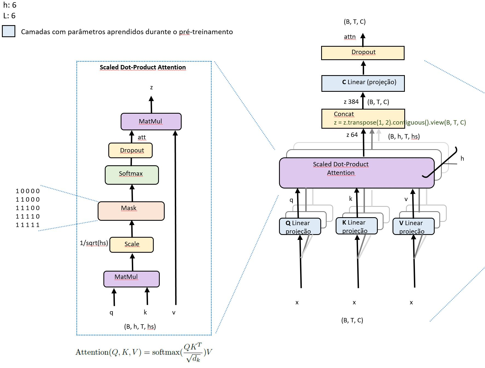

# GPTLab

Este projeto foi baseado no trabalho do Anderej Karpathy [“Let's build GPT: from scratch”](https://www.youtube.com/watch?v=kCc8FmEb1nY), mas foi adaptado para oferecer um aprendizado mais prático e didático do modelo. O principal objetivo deste trabalho é ajudar as pessoas a entenderem a estrutura dos modelos de linguagem autoregressivos. Também introduz conceitos básicos sobre tensores, PyTorch e redes neurais. Grande parte dessas alterações foi inspirada no código-fonte encontrado em [huggingface/transformers PyTorch implementation](https://github.com/huggingface/transformers/blob/main/src/transformers/models/gpt2/modeling_gpt2.py)

Se você não é especialista em deep learning mas deseja entender as arquiteturas desses Modelos de Linguagem de Grande Escala (LLMs), a forma mais rápida de começar é treinar um modelo nanoGPT de tamanho 200k (usando CPU) ou 10M (usando uma GPU de 4 GB). Para o corpus de treinamento, você pode utilizar as obras de Machado de Assis ou de Shakespeare.

*Disclaimer: Este artigo foi escrito com o apoio do ChatGPT.*


&nbsp;  
## Índice
1. [Instalação](#1---instalação)
2. [Tokenizer](#2---tokenizer)
3. [Modelo GPT](#3---modelo-gpt)
4. [Explicando o modelo nanoGPT](#4---explicando-o-modelo-nanogpt)
5. [Estratégias de decodificação em grandes modelos de linguagem](#5---Estratégias-de-decodificação-em-grandes-modelos-de-linguagem)
6. [Função objetivo no pré-treinamento](#6---função-objetivo-no-pré-treinamento)
7. [Eu tenho uma GPU](#7---eu-tenho-uma-gpu)
8. [Eu só tenho um PC comum](#8---eu-só-tenho-um-pc-comum)
9. [Experimento 1 - Visualizando embeddings](#9---experimento-1)
10. [Experimento 2 - Vídeos sobre embeddings](#10---experimento-2)
11. [Experimento 3 - Variando a Temperatura](#11---experimento-3)
12. [Experimento 4 - Qual tokenizador usar: caracteres ou subpalavras](#12---experimento-4)
13. [Experimento 5 - Plotando os pesos de atenção](#13---experimento-5)
14. [Referências](#14---referências)


&nbsp;  
&nbsp;  
<br/>

## 1 - Instalação

Dependências:

- python >= 3.9
- [pytorch](https://pytorch.org) >= 1.8.1
- sklearn==1.2.2
- gensim==4.3.1
- tiktoken

OBS: Flash Attention: verificar se versão do PyTorch tem suporte.
<br/><br/>
<br/>
<br/>

## 2 - Tokenizer
Neste projeto, empregamos um tokenizador em nível de caractere, o qual opera individualmente com cada letra do texto. É uma abordagem diferente da tokenização em nível de palavra, que divide o texto em palavras ou subpalavras separadas. O tokenizador em nível de caractere separa o texto em cada uma de suas letras.

Esse tipo de tokenizador divide o texto em caracteres únicos, representando cada letra como um token diferente. Isso proporciona uma representação mais detalhada do texto e é capaz de lidar eficientemente com palavras raras ou não usuais. No entanto, pode não capturar a semântica na escala da palavra e tende a aumentar o comprimento da sequência.

Uma grande vantagem de usar esse tipo de tokenizador é que ele reduz o número de parâmetros na matriz de incorporação. 

```python
wte = nn.Embedding(config.vocab_size, config.n_embd)
```

Ao usar o treinamento em GPU, temos um vocabulário de 115 e a dimensão do vetor de embeddings é de 384. Isso resulta em um total de 44.160 parâmetros, calculados a partir de 115x384. O número total de parâmetros deste modelo é de 10.683.264, então a camada de embeddings se traduz em apenas 0,41% deste valor total.

Se optarmos pelo uso do tokenizador do GPT-2, que usa o algoritmo [BPE](https://huggingface.co/learn/nlp-course/chapter6/5?fw=pt) para tokenização, iríamos lidar com um vocabulário consideravelmente maior, de 50.257 palavras. Isso implicaria num aumento significativo no tamanho do modelo para 19.298.688 parâmetros, provenientes de 50.257x384. Nesse caso, a camada de embeddings seria responsável por 64,46% do tamanho do modelo.

Portanto, a melhor alternativa é utilizar um tokenizador em nível de caracteres, pois isso reduz o consumo de memória e o tempo de processamento.

O nosso objetivo, no entanto, é possibilitar que a maioria dos usuários, mesmo aqueles com um computador comum e sem uma GPU poderosa (que geralmente têm um custo elevado), possam treinar este modelo.

<br/><br/>
<br/>

## 3 - Modelo GPT
Os modelos de linguagem baseados em inteligência artificial têm desempenhado um papel cada vez mais importante na geração de  texto coerente e relevante com base em um contexto fornecido. Um desses modelos notáveis é o GPT (Generative Pre-trained Transformer), desenvolvido pela OpenAI.  

Neste projeto, exploramos o potencial do nanoGPT como uma ferramenta de auxílio para o entendimento da arquitetura dos Modelos de Linguagem de Grande Escala (LLM). O nanoGPT, uma versão compacta e acessível do GPT criada por Andrej Karpathy e disponível no repositório do [GitHub](https://github.com/karpathy/nanoGPT). 

### Comparação de vários modelos LLMs com o nanoGPT
&nbsp;  
[A Survey of Large Language Models](https://arxiv.org/abs/2303.18223)

Comparação de vários modelos LLMs com detalhes de configurações públicas com o **nanoGPT**. Aqui, `PE` denota embeddings posicional, `#L` denota o número de camadas, `#H` denota o número de heads de atenção, `dmodel` denota a dimensão do modelo e `MCL` denota o comprimento máximo do contexto durante o treinamento.
&nbsp;  

| Model      | Category       | Size      | Normalization      | PE      | Activation    | Bias    | #L      | #H      | dmodel      | MCL      |
| ---------- | -------------- | --------- | ------------------ | ------- | ------------- | ------- | ------- | ------- | ----------- | -------- |
| GPT3       | Causal decoder | 175B      | Pre Layer Norm     | Learned | GeLU          | X       | 96      | 96      | 12288       | 2048     |
| PanGU      | Causal decoder | 207B      | Pre Layer Norm     | Learned | GeLU          | X       | 64      | 128     | 16384       | 1024     |
| OPT        | Causal decoder | 175B      | Pre Layer Norm     | Learned | ReLU          | X       | 96      | 96      | 12288       | 2048     |
| PaLM       | Causal decoder | 540B      | Pre Layer Norm     | RoPE    | SwiGLU        |         | 118     | 48      | 18432       | 2048     |
| BLOOM      | Causal decoder | 176B      | Pre Layer Norm     | ALiBi   | GeLU          | X       | 70      | 112     | 14336       | 2048     |
| MT-NLG     | Causal decoder | 530B      | -                  | -       | -             | -       | 105     | 128     | 20480       | 2048     |
| Gopher     | Causal decoder | 280B      | Pre RMS Norm       | Relative| -             | -       | 80      | 128     | 16384       | 2048     |
| Chinchilla | Causal decoder | 70B       | Pre RMS Norm       | Relative| -             | -       | 80      | 64      | 8192        | -        |
| Galactica  | Causal decoder | 120B      | Pre Layer Norm     | Learned | GeLU          | -       |96       | 80      | 10240       | 2048     |
| LaMDA      | Causal decoder | 137B      | -                  | Relative| GeGLU         | -       | 64      | 128     | 8192        | -        |
| Jurassic-1 | Causal decoder | 178B      | Pre Layer Norm     | Learned | GeLU          | x       | 76      | 96      | 13824       | 2048     |
| LLaMA      | Causal decoder | 65B       | Pre RMS Norm       | RoPE    | SwiGLU        | x       | 80      | 64      | 8192        | 2048     |
| GLM-130B   | Prefix decoder | 130B      | Post Deep Norm     | RoPE    | GeGLU         | x       | 70      | 96      | 12288       | 2048     | 
| T5         | Encoder-decoder| 11B       | Pre RMS Norm       | Relative| ReLU          | -       | 24      | 128     | 1024        | 512      |
| **nanoGPT**| Causal decoder | 10M       | Pre Layer Norm     | Learned | GeLU          | x       | 6       | 6       | 384         | 256      |

&nbsp;  
&nbsp;  
O **nanoGPT** é baseado no modelo GPT, que é um modelo de linguagem baseado em inteligência artificial que foi treinado em grandes quantidades de dados textuais para aprender a prever a próxima palavra em uma sequência de palavras. Ele é baseado na arquitetura [Transformer](https://arxiv.org/abs/1706.03762), mas utiliza apenas o decoder e remove as partes relacionadas ao encoder (ver figura abaixo).
&nbsp;  
&nbsp;  


fig 3.1
&nbsp;  
&nbsp;  
O **nanoGPT** usa como base a arquitetura do Transformer, expandindo-a ao aplicar aprendizado não supervisionado a grandes volumes de dados textuais, em um processo denominado pré-treinamento. Durante esse pré-treinamento, o nanoGPT é exposto a um conjunto específico de textos, como as obras de Machado de Assis ou uma parte específica da obra de Shakespeare, e tem como tarefa prever o próximo caractere de acordo com o contexto fornecido. Através dessa tarefa, o modelo adquire conhecimento sobre os padrões estatísticos e as estruturas sintáticas presentes na linguagem humana.
&nbsp;  
<br/>
A seguir está uma figura descrevendo detalhadamente a arquitetura do modelo **nanoGPT**. Observe que cada módulo apresenta informações sobre as dimensões dos tensores na sua saída. Você pode utilizar este arquivo [GPT_model.pptx](https://github.com/wmelo52/GPTLab/blob/master/GPT_model.pptx) para acompanhar a explicação deste modelo nos próximos parágrafos.
<br/><br/>


fig 3.2
   
```
nanoGPTModel(
  (transformer): ModuleDict(
    (wte): Embedding(115, 384)
    (wpe): Embedding(64, 384)
    (drop): Dropout(p=0.1, inplace=False)
    (h): ModuleList(
      (0-5): 6 x Block(
        (ln_1): LayerNorm()
        (attn): MultiHeadedAttention(
          (q_linear): Linear(in_features=384, out_features=384, bias=True)
          (v_linear): Linear(in_features=384, out_features=384, bias=True)
          (k_linear): Linear(in_features=384, out_features=384, bias=True)
          (c_proj): Linear(in_features=384, out_features=384, bias=False)
          (attn_dropout): Dropout(p=0.1, inplace=False)
          (resid_dropout): Dropout(p=0.1, inplace=False)
        )
        (ln_2): LayerNorm()
        (mlp): MLP(
          (c_fc): Linear(in_features=384, out_features=1536, bias=False)
          (c_proj): Linear(in_features=1536, out_features=384, bias=False)
          (dropout): Dropout(p=0.1, inplace=False)
        )
      )
    )
    (ln_f): LayerNorm()
  )
  (lm_head): Linear(in_features=384, out_features=115, bias=False)
)
```
&nbsp;  
<br/> <br/>
<br/>


<br/>

## 4 - Explicando o modelo nanoGPT
&nbsp; 
***Embeddings Posicional e Word Embeddings***

No decodificador do modelo nanoGPT são usados dois tipos de embeddings: Embeddings Posicional e Word Embeddings (embeddings de palavras).

**Embeddings Posicional (wpe):**<br/>
As Embeddings Posicional são usadas para codificar a posição relativa de cada palavra na sequência de entrada. Elas são necessárias porque o modelo nanoGPT não possui informações explícitas de posição em suas entradas. Essas embeddings são adicionadas aos embeddings de palavras para fornecer ao modelo informações sobre a ordem das palavras na sequência.

Normalmente, as Embeddings Posicionais são representadas como vetores numéricos com padrões específicos para cada posição, capturando assim a posição relativa das palavras.

Dessa forma, as Embeddings Posicionais auxiliam o modelo a compreender a ordem sequencial dos tokens e permitem que ele capture dependências de longo alcance.

No decodificador nanoGPT, as Embeddings Posicional são aprendidas durante o treinamento do modelo.

**Word Embeddings (wte):**<br/>
As Word Embeddings são representações vetoriais das palavras presentes na sequência de entrada. Essas representações capturam informações semânticas e sintáticas das palavras, permitindo que o modelo entenda melhor o significado e a relação entre elas.

Os Word Embeddings também são aprendidos durante o treinamento do modelo.

Suponha que cada vetor de embeddings seja de dimensão 384 e suponha que nosso tamanho de vocabulário seja 115, então nossa matriz de embeddings será de tamanho 115x384. Essas matrizes serão aprendidas no treinamento e durante a inferência cada palavra será mapeada para o vetor de dimensão 384 correspondente. Suponha que tenhamos tamanho de lote de 32 e comprimento de sequência de 64 (64 tokens). A saída será 32x64x384 (B, T, C).
&nbsp;  
<br/><br/>

***Dropout***

O Dropout é uma técnica utilizada em modelos de redes neurais para prevenir o overfitting, que ocorre quando um modelo se ajusta muito bem aos dados de treinamento, mas não generaliza bem para novos dados. O objetivo do Dropout é regularizar o modelo, reduzindo a dependência excessiva de neurônios específicos e promovendo a robustez da rede.

Durante o treinamento, o Dropout desativa aleatoriamente um número de neurônios em cada camada com uma certa probabilidade, definida como a taxa de dropout. Isso significa que esses neurônios não contribuem para a propagação do sinal durante uma etapa específica do treinamento. Como resultado, a rede é forçada a aprender representações redundantes e distribuir a informação entre diferentes conjuntos de neurônios.

Essa aleatoriedade introduzida pelo Dropout reduz a capacidade da rede de memorizar ruídos ou padrões irrelevantes nos dados de treinamento, tornando-a mais resiliente a variações e mais apta a generalizar para novos exemplos. Além disso, o Dropout também ajuda a evitar a co-adaptação entre neurônios, onde certos neurônios se especializam demais em padrões específicos, limitando a capacidade de generalização da rede.

Após o treinamento, o Dropout não é aplicado durante a fase de inferência, pois todos os neurônios estão ativos. No entanto, os pesos dos neurônios são escalados pela taxa de dropout para compensar o fato de que menos neurônios estão ativos durante o treinamento, garantindo que a saída do modelo permaneça consistente em ambas as fases.

Este módulo é implementado pelo framework PyTorch (`nn.Dropout(0,1)`) e é utilizado em várias partes do modelo nanoGPT: antes da entrada do bloco do Decodificador, na parte final do mecanismo de atenção e na parte final do módulo MLP.

<br/><br/>
***Camada de Normalização***<br/>

No decodificador do modelo nanoGPT, a camada de normalização refere-se à camada de normalização por camada (Layer Normalization) aplicada antes do módulo de self-attention e do módulo de MLP - Multilayer perceptron e antes do módulo MHA (Multi-Head Attention).

Essa camada desempenha um papel importante na estabilização do treinamento e na melhoria do desempenho do modelo. A camada de normalização é uma técnica utilizada em redes neurais para normalizar os valores de ativação em cada camada. Ela ajuda a mitigar o problema da distribuição não uniforme das ativações, tornando o treinamento mais estável e eficiente.

Especificamente, a normalização por camada calcula as estatísticas de média e variância dos valores de ativação em uma camada específica e, em seguida, normaliza os valores subtraindo a média e dividindo pelo desvio padrão. Isso é feito para cada unidade de ativação individualmente. A fórmula matemática para a normalização por camada é a seguinte:
```
y = a_2*((x - μ)/σ + eps) + b_2
```
Onde:
- `y` é a saída normalizada,
- `x` é a entrada original,
- `μ` é a média dos valores de ativação na camada,
- `σ` é o desvio padrão dos valores de ativação na camada.
- `a_2` dimensiona o tensor normalizado, (x - média) / (std + eps) que normaliza a entrada,
- `b_2` é um termo de viés opcional.

OBS: `a_2` e `b_2` são parâmetros aprendido durante o pré-treinamento de dimenão 384.

A normalização por camada tem o efeito de centralizar os valores de ativação em torno de zero e escalá-los para uma distribuição com variância unitária. Isso traz benefícios para o treinamento do modelo, pois ajuda a evitar o problema de gradiente desvanecido ou explosivo, facilita a propagação dos gradientes e melhora a capacidade do modelo de generalizar.

Além disso, a normalização por camada é aplicada independentemente para cada exemplo de entrada na dimensão do lote, o que permite que o modelo se beneficie de uma normalização adaptativa que leva em consideração as estatísticas específicas de cada exemplo. Isso é especialmente relevante em cenários onde existem variações significativas nos dados de entrada, garantindo assim que o modelo esteja ajustado de forma adequada para diferentes casos.

```python
class LayerNorm(nn.Module):
    "Constroi um módulo layernorm."

    def __init__(self, ndim, bias, eps=1e-5):
        super(LayerNorm, self).__init__()
        self.a_2 = nn.Parameter(torch.ones(ndim))
        self.b_2 = nn.Parameter(torch.zeros(ndim)) 
        self.eps = eps

    def forward(self, x):
        mean = x.mean(-1, keepdim=True)
        std = x.std(-1, keepdim=True)
        return self.a_2 * (x - mean) / (std + self.eps) + self.b_2 
```

<br/><br/>

***Conexão Residual***<br/>

A conexão residual no decodificador do nanoGPT é usada como um caminho alternativo nos módulos Multi-Head Attention (`MHA`) e MultiLayer Perceptron (`MLP`).

Essa conexão residual permite que as informações fluam diretamente do bloco anterior para o bloco seguinte, contornando os módulos de atenção e MLP. Isso é feito através da adição dos valores de ativação do bloco anterior aos valores de ativação do bloco atual.

A conexão residual é benéfica porque ajuda a mitigar o problema de desvanecimento do gradiente, permitindo que as informações relevantes sejam preservadas e transmitidas através das camadas do modelo. Além disso, ela facilita a otimização do modelo, permitindo que o gradiente seja propagado mais facilmente durante o treinamento.

<br/><br/>
***O que é self-attention?***<br/><br/>
<!-- <p align="center">

</p> -->


fig 4.1
<br/><br/>

O mecanismo de self-attention, também conhecido como "atenção própria" ou "autoatenção", é um componente fundamental no decodificador do modelo nanoGPT (Generative Pre-trained Transformer).

O objetivo do mecanismo de self-attention é permitir que o modelo nanoGPT capture as relações de dependência entre as palavras em uma sequência de entrada. Ele permite que cada palavra se "atente" para outras palavras na sequência e pondera sua importância com base nessas interações.

O mecanismo de self-attention opera em três componentes principais: consultas (queries), chaves (keys) e valores (values). Para cada palavra em uma sequência, são geradas as consultas (q), chaves (k) e valores (v), que são utilizados para calcular os pesos de atenção. 

O processo de self-attention ocorre em três etapas:
<br/><br/>

**Etapa 1 - Vetores de Consulta, Chave e Valor** <br/>
Geração de Consultas (q), Chaves (k) e Valores (v): Cada palavra na sequência de entrada é mapeada para três representações diferentes - uma consulta (q), uma chave (k) e um valor (v). Essas representações são obtidas por projeções lineares da representação de entrada (x).

Teremos uma matriz de chave(**K**), matriz de consulta(**Q**) e uma matriz de valor(**V**) para gerar os vetores k, q, v. 

As matrizes de projeção (**Q**, **K**, **V**) são aprendidas durante o treinamento. Isso significa que o modelo tem a capacidade de ajustar essas projeções para melhorar a performance na tarefa específica.

A transformação linear (ou projeção) permite que o modelo seja mais flexível. Em vez de operar diretamente nos vetores de entrada, o modelo tem a liberdade de projetá-los em um espaço onde os cálculos de atenção sejam mais significativos.

Aqui estão as principais finalidades do uso da projeção no mecanismo de self-attention:<br/>
**Transformação de Espaço**: As projeções permitem transformar as representações de entrada para diferentes espaços. Por exemplo, a entrada original pode estar em um espaço dimensional 
d, mas queremos representações de Query, Key e Value em um espaço diferente, digamos dk
 . As matrizes de projeção realizam essa transformação.

**Diversidade de Representações**: Ao projetar a entrada para criar Q, K e V, estamos essencialmente criando diferentes representações da entrada original. Isso permite que o mecanismo de atenção capture diferentes tipos de interações e relacionamentos na sequência.

**Adição de Capacidade ao Modelo**: Introduzir uma transformação linear adiciona parâmetros treináveis ao modelo. Isso pode potencialmente permitir ao modelo aprender representações mais complexas e ricas dos dados.
<br/><br/>

**Etapa 2 - Cálculo de Scores de Atenção**<br/>
 Ver figura 4.1 acima "*Scaled Dot-Product Attention*"

A segunda etapa é calcular a pontuação (score), ou seja, vamos multiplicar a matriz de consulta com a matriz de chave. [Q x K.t]

Cálculo dos Pesos de Atenção: Os pesos de atenção são calculados através do produto escalar entre as consultas e as chaves. Esse produto escalar é escalado pela raiz quadrada da dimensão das chaves para evitar que os valores sejam muito grandes. 

Desta vez a grande diferença é que usamos uma máscara com Multi-Head Attention.

*Por que máscara?*<br/>
Devido à natureza autoregressiva do GPT, é fundamental garantir que, ao prever uma palavra, o modelo só considere palavras anteriores e não as subsequentes. Para isso, o nanoGPT utiliza uma "máscara causal" no mecanismo de self-attention, que efetivamente impede que o modelo atenda a palavras futuras na sequência.

**Etapa 3 - Normalização dos Scores**<br/>
Os scores são então passados por uma função softmax, que os transforma em probabilidades que somam 1. Isso garante que palavras mais relevantes para a predição atual tenham maior peso.
<br/><br/>

**Etapa 4 - Cálculo da Saída do Self-Attention**<br/>
Os scores normalizados (att) são usados para ponderar os vetor de valores (v). O resultado é um vetor ponderado que captura informações relevantes de todas as palavras anteriores na sequência.

O resultado é uma representação contextualizada para cada palavra, levando em consideração as relações com as outras palavras da sequência.

```python
def attention(q, k, v, mask_att, attn_dropout, mask=None, dropout=None):   
    # Suspeitamos que para grandes valores de n_embd, os produtos escalares crescem em magnitude, 
    # empurrando a função softmax para regiões onde ela produz gradientes extremamente pequenos
    # Para neutralizar esse efeito, escalamos os produtos escalares por 1/raiz(n_embd//n_head (1.0 / math.sqrt(k.size(-1)))
    att = (q @ k.transpose(-2, -1)) * (1.0 / math.sqrt(k.size(-1)))
    if mask is not None:
        att = att.masked_fill(mask_att == 0, float('-inf'))
    att = F.softmax(att, dim=-1)
    if dropout != 0.0:
        att = attn_dropout(att)
    z = att @ v # (B, nh, T, T) x (B, nh, T, hs) -> (B, nh, T, hs)
    return z
```
<br/>

**Etapa 5 - Concatenação**<br/>
Assim que tivermos isso, passaremos por uma camada de concatenação em que é feito por esta linha de código em python:
```python
z = z.transpose(1, 2).contiguous().view(B, T, C)
```
<br/>

**Etapa 6 - projeção C Linear**<br/>
Depois passaremos por uma camada de projeção C Linear. Isso forma a saída da Multi-Head Attention.
A camada C Linear na saída do mecanismo de self-attention serve para transformar a representação ponderada resultante em um espaço dimensional adequado e adicionar mais capacidade ao modelo. 
 Introduzir essa transformação linear adiciona mais parâmetros ao modelo, o que pode ajudar o modelo a aprender representações mais ricas e complexas.
<br/>
<br/>

Em resumo, o mecanismo de self-attention no decodificador do nanoGPT permite que o modelo considere todas as palavras anteriores na sequência de forma ponderada ao gerar uma nova palavra, garantindo que a saída seja contextualmente relevante e coerente.


<br/><br/>
**MLP - Multilayer perceptron**<br/><br/>
<p align="left">
<br/>
fig 4.2
</p>
<br/>

No contexto dos Transformers e, consequentemente, do nanoGPT, o MLP é usado após o mecanismo de self-attention em cada bloco do decodificador. Vamos entender suas características e finalidade:

1. **Estrutura Básica**: O MLP no modelo nanoGPT é composto por duas camadas lineares (ou densas) separadas por uma função de ativação não-linear, uma função new [GELU](https://arxiv.org/abs/1606.08415) (Gaussian Error Linear Unit).

A função new Gelu é definida matematicamente como:
```python
gelu(x) = 0.5 * x * (1 + tanh(sqrt(2/pi) * (x + 0.044715 * x^3)))
```

2. **Aumento da Capacidade do Modelo**: O MLP adiciona parâmetros adicionais ao modelo, permitindo-lhe aprender representações mais complexas. Enquanto o mecanismo de self-attention ajuda o modelo a entender as relações entre diferentes posições em uma sequência, o MLP permite ao modelo aprender transformações complexas dessas representações.

3. **Transformações Não-lineares**: Uma das principais funções do MLP é introduzir não-linearidades no modelo. Os Transformers, por natureza, consistem em várias operações lineares, como multiplicação de matrizes e somas. Sem o MLP e sua função de ativação não-linear, o modelo seria essencialmente uma série de operações lineares, limitando sua capacidade de aprender e representar funções complexas.

4. **Feed-forward**: Muitas vezes, o MLP nos Transformers é referido como a camada "feed-forward". Isso porque, diferentemente do mecanismo de self-attention que considera as relações entre todos os tokens, o MLP opera em cada posição (ou token) de forma independente. Em outras palavras, ele aplica a mesma transformação feed-forward a cada posição separadamente.

5. **Dimensionalidade**: No nanoGPT e em outros Transformers, o MLP geralmente começa com uma camada que aumenta a dimensionalidade (chamada de "expansão") e depois a reduz novamente. Isso permite que o modelo crie e depois condense representações ricas.

Em resumo, o MLP no decodificador do nanoGPT serve para introduzir não-linearidades e aprender transformações complexas nas representações produzidas pelo mecanismo de self-attention. Ele complementa o mecanismo de self-attention, permitindo que o nanoGPT modele efetivamente tanto as relações entre tokens quanto as transformações complexas dessas relações.

```python
class MLP(nn.Module):

    def __init__(self, config):
        super().__init__()
        self.c_fc    = nn.Linear(config.n_embd, 4 * config.n_embd, bias=config.bias)
        self.c_proj  = nn.Linear(4 * config.n_embd, config.n_embd, bias=config.bias)
        self.dropout = nn.Dropout(config.dropout)

    def forward(self, x):
        x = self.c_fc(x)
        x = new_gelu(x)
        x = self.c_proj(x)
        x = self.dropout(x)
        return x
```

<br/><br/>  

**Linear Head**<br/>

A camada "Linear Head" no decodificador do modelo nanoGPT é a camada final responsável por produzir as predições do modelo (logits).

**Transformação Linear**: A "Linear Head" é uma camada densa ou linear que transforma as representações ocultas (ou embeddings) produzidas pelo bloco de decodificador do nanoGPT em scores (logits) para cada token possível no vocabulário.

Em resumo, a camada `Linear Head` no decodificador do nanoGPT é a camada de saída que transforma as representações internas do modelo em predições concretas para o próximo token na sequência. Ela desempenha um papel crucial tanto no treinamento (ajustando seus pesos para minimizar o erro) quanto na inferência (gerando novos textos).

<br/><br/>
<br/>  


## 5 - [Estratégias de decodificação em grandes modelos de linguagem](https://mlabonne.github.io/blog/posts/2023-06-07-Decoding_strategies.html)

Existe um equívoco comum de que LLMs como Llama-2 produzem texto diretamente. Este não é o caso. Em vez disso, os LLMs calculam logits, que são pontuações (score) atribuídas a cada possível token em seu vocabulário. Estas pontuações são normalizadas pela função softmax e transformadas numa distribuição multinomial discreta onde o número de variáveis é o tamanho do vocabulário, ver fig. 5.1.

A decodificação é o processo pelo qual um modelo de linguagem gera sequências de texto com base nos logits (saídas não normalizadas) produzidos pelo modelo. 

### Generate<br/>
A função `generate` é fundamental em modelos generativos como o nanoGPT, sendo responsável pela produção de sequências de texto a partir de uma entrada ou prompt fornecido.

Existem várias estratégias de decodificação que podem influenciar a qualidade e a diversidade do texto gerado. Aqui estão algumas das estratégias implementadas no método **generate**:
<br/>

**1 - Temperatura**<br/>
No contexto dos modelos de Linguagem de Múltiplas Tarefas (LLM), como o ChatGPT, o parâmetro "temperatura" é uma configuração que controla a aleatoriedade e a suavidade das respostas geradas pelo modelo.

O parâmetro temperatura é usado durante o processo de amostragem para equilibrar a exploração e a explotação do modelo. Quando a temperatura é alta, as respostas geradas pelo modelo tendem a ser mais aleatórias, diversificadas e surpreendentes. Por outro lado, quando a temperatura é baixa, as respostas são mais determinísticas, coerentes e previsíveis.

Ao definir a temperatura, você pode ajustar o equilíbrio entre a criatividade do modelo e a coesão das respostas. Uma temperatura alta pode levar a respostas mais criativas, mas também pode resultar em respostas incoerentes ou fora de contexto. Por outro lado, uma temperatura baixa pode fornecer respostas mais seguras, mas potencialmente menos interessantes.

Por exemplo, quando a temperatura é definida como 0 (zero), a amostragem é totalmente determinística, e o modelo sempre escolherá a palavra mais provável em cada etapa de geração de texto (muito parecido com o uso de `torch.argmax`). Em contrapartida, uma temperatura alta, como 1.0 ou superior, permitirá que o modelo explore mais as diferentes possibilidades e gere respostas mais variadas.
<br/>
<br/>

**Explicando o conceito visualmente.**

A escala de temperatura regula a variabilidade das respostas geradas pelo modelo. Ela influencia a entropia da distribuição de probabilidade usada na seleção da próxima palavra, determinando se essa palavra será mais surpreendente ou previsível. Tecnicamente, isso é alcançado ao dividir o vetor logit pelo valor representado por 'T', que simboliza a temperatura. Em seguida, a função softmax é aplicada ao resultado.

$\large P_i=\frac{e^{\frac{logit_i}T}}{\sum_{k=1}^n e^{\frac{logit_k}T}}$
<br/>
```python
logits = logits[:, -1, :] / temperature
# aplique softmax para converter logits em probabilidades (normalizadas)
probs = F.softmax(logits, dim=-1)
# tire uma amostra da distribuição 
idx_next = torch.multinomial(probs, num_samples=1)
``` 
&nbsp;  
<br/>
<br/>
fig 5.1

fonte: https://medium.com/mlearning-ai/softmax-temperature-5492e4007f71
<br/>
&nbsp;  

Implementação no método generate:
```python
   logits = logits[:, -1, :] / temperature
```
<br/>

**2 - Penalidade de Frequência**

A penalidade de frequência é uma técnica aplicada em grandes modelos de linguagem com o objetivo de reduzir a repetição de palavras ou frases no texto gerado. Em contextos de geração de texto, especialmente quando são solicitadas sequências mais longas, o modelo pode começar a repetir certas palavras ou frases, resultando em um texto menos coerente ou monótono. A penalidade de frequência serve para mitigar esse problema.

Funcionamento básico da penalidade de frequência:

1. **Monitoramento de Tokens**: À medida que o modelo gera texto, os tokens (que podem ser palavras ou subpalavras) produzidos são monitorados ou contados.

2. **Aplicação da Penalidade**: Antes de decidir o próximo token a ser gerado, o modelo verifica os tokens já produzidos. Se um token já foi gerado anteriormente, a probabilidade (ou logit) associada a esse token é penalizada, ou seja, reduzida.

3. **Fator de Penalidade**: A magnitude da penalidade pode ser controlada por um fator. Por exemplo, se o fator de penalidade for `1.0`, a probabilidade de um token que já foi gerado uma vez será reduzida em uma unidade. Se o token tiver sido gerado duas vezes, sua probabilidade será reduzida em duas unidades, e assim por diante.

Benefícios:

- **Diversidade**: A introdução da penalidade de frequência pode resultar em saídas mais diversas, pois o modelo é desencorajado de repetir as mesmas palavras ou frases.

- **Redução de Loops**: Em alguns casos, sem a penalidade de frequência, o modelo pode entrar em loops, repetindo a mesma frase ou sequência de palavras indefinidamente.

- **Maior Coerência**: Ao evitar repetições desnecessárias, o texto gerado pode se tornar mais coerente e fluente.

Considerações:

- **Balanceamento**: É importante balancear a penalidade. Uma penalidade muito alta pode fazer com que o modelo evite repetir palavras que seriam naturalmente repetidas em um contexto real (por exemplo, preposições ou conjunções). Por outro lado, uma penalidade muito baixa pode não ser suficiente para evitar repetições indesejadas.

- **Integração com Outras Técnicas**: A penalidade de frequência pode ser combinada com outras técnicas de refinamento da geração de texto, como a penalidade de temperatura, para obter saídas ainda mais controladas e coerentes.
<br/>
<br/>

Implementação no método generate:
```python
    # A penalidade de frequência é utilizada para reduzir a repetição de palavras ou frases no texto gerado.
    # que já foram produzidas na sessão de geração atual. 
    if frequency_penalty is not None:
        logits = self.apply_frequency_penalty(logits, idx_cond, frequency_penalty).to(device)
```
<br/>

**3 - Penalidade de Presença**

A Penalidade de Presença é uma técnica usada para controlar e guiar a geração de texto em grandes modelos de linguagem (LLMs). Enquanto técnicas como a penalidade de frequência visam reduzir repetições ao penalizar tokens que já foram gerados, a penalidade de presença foca em ajustar a probabilidade de determinados tokens ou frases serem gerados, seja para aumentá-la ou diminuí-la.

A ideia básica da penalidade de presença é modificar os logits (valores que determinam a probabilidade de geração de cada token) com base em critérios predefinidos para encorajar ou desencorajar o modelo a gerar certas palavras ou conceitos.

Vejamos algumas situações práticas de seu uso:

1. **Promover Valores ou Diretrizes Específicas**:
   - Se você deseja que o modelo produza saídas que estejam alinhadas com determinados valores ou diretrizes (por exemplo, promover positividade ou evitar linguagem ofensiva), você pode usar a penalidade de presença para aumentar a probabilidade de palavras positivas ou diminuir a probabilidade de palavras negativas.

2. **Guiar a Geração de Texto**:
   - Se você estiver buscando respostas ou saídas que incluam ou evitem temas específicos, a penalidade de presença pode ser usada para guiar o modelo nessa direção.

3. **Melhorar a Precisão em Tarefas Específicas**:
   - Em tarefas como tradução ou resumo, onde certas palavras ou conceitos são mais relevantes, a penalidade de presença pode ser aplicada para garantir que esses conceitos sejam priorizados.

Implementação:
Para implementar a penalidade de presença, você pode ajustar os logits do modelo antes da etapa de decodificação. Isso é feito adicionando ou subtraindo um valor de penalidade dos logits associados aos tokens específicos que você deseja encorajar ou desencorajar.

Vantagens:
- **Controle Adicional**: Fornece uma camada extra de controle sobre o que o modelo gera.
- **Flexibilidade**: Pode ser ajustada para diferentes palavras, frases ou conceitos, dependendo da necessidade.

Desafios:
- **Escolha Cuidadosa**: A determinação dos valores de penalidade requer experimentação, pois uma penalidade muito forte pode levar a saídas não naturais ou forçadas.
- **Conhecimento do Modelo**: Para aplicar efetivamente a penalidade de presença, é útil ter um entendimento de como o modelo funciona e quais tokens são relevantes para a tarefa em questão.
<br/>
<br/>
Implementação no método generate:
```python
  # top_k: top probabilidades, opcionalmente, corte os logits para apenas as k principais opções
  if top_k is not None:
      # torch.topk - retorna os k maiores elementos do tensor de entrada fornecido ao longo de uma determinada dimensão.
      v, _ = torch.topk(logits, min(top_k, logits.size(-1)))
      logits[logits < v[:, [-1]]] = -float('Inf')       
```
<br/>
<br/>

**4 - top_k** 

O `top_k` é uma estratégia de decodificação utilizada para controlar a geração de texto em grandes modelos de linguagem, como o GPT da OpenAI. A abordagem `top_k` visa restringir o espaço de possíveis tokens considerados para a próxima etapa de geração, baseando-se nos `k` tokens mais prováveis.
<br/><br/>
Em cada etapa, apenas os 'k' tokens mais prováveis são considerados para a amostragem.
Isso restringe a amostragem a um subconjunto de tokens, evitando escolhas muito improváveis.
<br/>
Implementação no método generate:
```python
  # top_k: top probabilidades, opcionalmente, corte os logits para apenas as k principais opções
  if top_k is not None:
      # torch.topk - retorna os k maiores elementos do tensor de entrada fornecido ao longo de uma determinada dimensão.
      v, _ = torch.topk(logits, min(top_k, logits.size(-1)))
      logits[logits < v[:, [-1]]] = -float('Inf')       
```
<br/>
<br/>

**5 - Decodificação por Limite de Duração** <br/>
Um limite pode ser definido para o número de tokens ou palavras que o modelo pode gerar. Isso pode ser útil para controlar a duração da saída. (`max_new_tokens e stop_sequence`)

A escolha da estratégia de decodificação depende do caso de uso específico. Por exemplo, para tarefas criativas onde a diversidade é valorizada, a amostragem ou Top-k podem ser preferíveis. Por outro lado, para tarefas onde a coerência e precisão são críticas, a decodificação gulosa (temperatura=0) podem ser mais apropriada.
<br/>
Implementação no método generate(`max_new_tokens`):
```python
  for _ in range(max_new_tokens):
```
Implementação no método generate(`stop_sequence`):
```python
  if stop_sequence is not None and self.detect_stop_sequence(idx, stop_sequence):
      break
```
<br/>
<br/>

Por fim, referimo-nos a uma função multinomial que realiza uma amostragem da distribuição:

```python
   # tire uma amostra da distribuição 
   idx_next = torch.multinomial(probs, num_samples=1)
```

- **torch.multinomial**: É uma função da biblioteca PyTorch que realiza amostragem multinomial. Ela recebe dois argumentos principais: **probs** e **num_samples*.<br/>
- **probs**: É um tensor que contém as probabilidades de cada evento na distribuição multinomial. Essas probabilidades devem ser não negativas e a soma de todas elas deve ser igual a 1.

- **num_samples**: É um inteiro que define quantas amostras serão obtidas na amostragem multinomial. No caso do código fornecido, é especificado como 1, o que significa que será retornada apenas uma amostra.

O resultado dessa chamada de função é atribuído à variável `idx_next`. A variável `idx_next` conterá o índice da palavra selecionada na distribuição multinomial, ou seja, a palavra que foi amostrada com base nas probabilidades fornecidas.

Em resumo, o código realiza a amostragem multinomial a partir de um tensor de probabilidades `probs` usando a função `torch.multinomial`. O resultado é um índice correspondente à palavra amostrada, que é armazenado na variável `idx_next`.

O arquivo [teste_multinomial_dist.py](https://github.com/wmelo52/GPTLab/blob/master/teste_multinomial_dist.py) dá uma boa intuição de como funciona esta amostragem de uma distribuição multinomial.
&nbsp;  
&nbsp;  
O gráfico abaixo mostra a distribuição de probabilidades na saída da função softmax usando um tokenizador em nível de caractere ([inference_nanoGPT_exp5.py](https://github.com/wmelo52/GPTLab/blob/master/inference_nanoGPT_exp5.py)).


fig 5.1
&nbsp;  &nbsp;  
&nbsp;  
&nbsp; 
<br/>
<br/>
<br/>
<br/>

## 6 - Função objetivo no pré-treinamento
 
A função objetivo no pré-treinamento do modelo **nanoGPT** tem como objetivo principal treinar o modelo para aprender a capturar e modelar padrões em textos de treinamento de maneira não supervisionada.    
O pré-treinamento do nanoGPT é realizado utilizando uma tarefa chamada de "previsão da palavra seguinte" (next-word prediction).

A função objetivo no pré-treinamento é definida da seguinte maneira: dado um contexto de tokens anteriores, o modelo é treinado para prever qual é o próximo token no texto original. Essa previsão é comparada com o token real que aparece no texto e a diferença entre a previsão e o token real é usada para calcular uma medida de perda, como a entropia cruzada (cross-entropy loss - a função de entropia cruzada é usada como uma medida para calcular a discrepância entre a distribuição de probabilidade prevista pelo modelo e a distribuição de probabilidade real dos dado).  

A fórmula da função de entropia cruzada discreta pode ser expressa da seguinte forma:
<p align="left">

</p>

Onde:
- H(p,q) é a entropia cruzada entre as distribuições 
- p representa a distribuição de probabilidade real dos dados.
- q representa a distribuição de probabilidade prevista pelo modelo.
- n é o número de tokens (caracteres) possíveis.

A entropia cruzada é calculada para cada evento possível (caractere, no caso do modelo nanoGPT) e, em seguida, somada para obter a perda total.

Durante o pré-treinamento, o modelo nanoGPT é alimentado com sequências de tokens de texto e treinado para ajustar os pesos de suas camadas, com o objetivo de maximizar a probabilidade de prever corretamente o próximo token no contexto fornecido. Esse processo é realizado de forma iterativa em um corpus de texto, como os Contos de Machado de Assis.

Ao prever a próxima palavra, o modelo é exposto a uma ampla variedade de contextos e padrões linguísticos, permitindo que ele aprenda a reconhecer e capturar informações sobre estrutura gramatical, sintaxe, semântica e co-ocorrência de palavras.

Após o pré-treinamento, o modelo nanoGPT pode ser ajustado (fine-tuned) para uma tarefa específica usando dados rotulados. Durante o ajuste fino, a função objetivo pode ser alterada para se adequar à tarefa em questão, como classificação de sentimentos, tradução ou geração de texto condicional.
&nbsp;  
&nbsp;  
O método abaixo implementa a função objetivo no treinamento do modelo nanoGPT:

```python
def get_batch(split):
    data = train_data if split == 'train' else val_data
    ix = torch.randint(len(data) - config.max_len, (config.batch_size,))
    x = torch.stack([torch.from_numpy((data[i:i + config.max_len]).astype(np.int64)) for i in ix])
    y = torch.stack([torch.from_numpy((data[i+1:i+1+config.max_len]).astype(np.int64)) for i in ix])
    
    if device == 'cuda':
        # pin arrays x,y, que nos permite movê-los para a GPU de forma assíncrona (non_blocking=True)
        x, y = x.pin_memory().to(device, non_blocking=True), y.pin_memory().to(device, non_blocking=True)
    else:
        x, y = x.to(device), y.to(device)
    return x, y
```

Dado a seguinte sentença: 
*"A figura é poética, mas "*, a sentença codificada para tokens:&nbsp;  

[26, 1, 57, 60, 58, 72, 69, 52, 1, 101, 1, 67, 66,101, 71, 60, 54, 52, 10, 1, 64, 52, 70]
&nbsp;  
&nbsp;  
A função objetivo para o pré-treinamento do modelo nanoGPT segue este padrão: 
&nbsp;  

```
quando a entrada é [26](A) o alvo é: 1( )
quando a entrada é [26, 1](A ) o alvo é: 57(f)
quando a entrada é [26, 1, 57](A f) o alvo é: 60(i)
quando a entrada é [26, 1, 57, 60](A fi) o alvo é: 58(g)
quando a entrada é [26, 1, 57, 60, 58](A fig) o alvo é: 72(u)
quando a entrada é [26, 1, 57, 60, 58, 72](A figu) o alvo é: 69(r)
quando a entrada é [26, 1, 57, 60, 58, 72, 69](A figur) o alvo é: 52(a)
quando a entrada é [26, 1, 57, 60, 58, 72, 69, 52](A figura) o alvo é: 1( )
quando a entrada é [26, 1, 57, 60, 58, 72, 69, 52, 1](A figura ) o alvo é: 101(é)
quando a entrada é [26, 1, 57, 60, 58, 72, 69, 52, 1, 101](A figura é) o alvo é: 1( )
quando a entrada é [26, 1, 57, 60, 58, 72, 69, 52, 1, 101, 1](A figura é ) o alvo é: 67(p)
quando a entrada é [26, 1, 57, 60, 58, 72, 69, 52, 1, 101, 1, 67](A figura é p) o alvo é: 66(o)
quando a entrada é [26, 1, 57, 60, 58, 72, 69, 52, 1, 101, 1, 67, 66](A figura é po) o alvo é: 101(é)
```
&nbsp;  
<br/>
<br/>
<br/>


## 7 - Eu tenho uma GPU

Para treinamento em GPU com pouca memória (4GB) os hiperparâmetros são ajustados para:
```
n_embd = 384
n_head = 6
n_layer = 6
dropout = 0.2
batch_size = 32 # Quantas sequências independentes processaremos em paralelo?
max_len = 64 # Qual é o comprimento máximo de contexto para previsões?
max_iters = 5000
```
O script [training_nanoGPT_GPU.py](https://github.com/wmelo52/GPTLab/blob/master/training_nanoGPT_GPU.py) é usado para treinar o modelo, utilizando o arquivo [obras_machado_de_assis_conto.txt](https://github.com/wmelo52/GPTLab/blob/master/corpus/machado_de_assis_conto.txt) como corpus de treinamento.


Utilizando o método "generate" para gerar algumas amostras de texto, com a temperatura ajustada para 1.0:

```
pé, que uma sobretupou o lenço
do Crispim Soares; mas apressaram
desde que estidade pagou. Quando o rajor se o ratador da vida
Luísa; mais só depois e adiantou o amor, — e razão uma simbina coisa
idade que tornava às esperanças daquele semitério, eu fosse, levantando a esta cartina
de dois banquavas, botaria do pobre estudo do coração era verdade.
— Tudo o que custava estão! o meu espírito e excio?
— Não.
— Que é isso. Aleganda curir por que estivesse é meia. Quanses? tomava
a exputo do marido?
— De ser isto: leitando-me a lugar à casa, outro voltou para certa comunicação, sabia
que perdia dela nentrara, olhava com a rua sagradadeira, enfim, aprovantando tacrefundo a
fechação e dos novos. Nã
```

Você poderia usar o script [inference_nanoGPT.py](https://github.com/wmelo52/GPTLab/blob/master/inference_nanoGPT.py) para gerar algum texto baseado numa sentença inicial. Basta fornecer a sentença inicial como entrada e o modelo irá gerar o texto correspondente.

&nbsp;

&nbsp;  
<br/>

## 8 - Eu só tenho um PC comum

Não há problema! Mesmo com um PC comum ou um computador mais barato, ainda podemos treinar o nanoGPT, mas há algumas medidas que podemos tomar para tornar o processo mais leve. 

Podemos ajustar as configurações do treinamento, como reduzir o tamanho do lote (batch size) e diminuir o número de camadas e unidades ocultas no modelo. Além disso, podemos usar um corpus de treinamento menor para acelerar o processo.

Com essas modificações, podemos adaptar o treinamento do nanoGPT para funcionar adequadamente em um PC comum ou computador mais simples.

Para o treinamento em CPU, recomenda-se o uso do arquivo [train_nanoGPT_cpu.py](https://github.com/wmelo52/GPTLab/blob/master/training_nanoGPT_CPU.py), onde os hiperparâmetros são ajustados para minimizar a memória necessária e o tempo de processamento. Você pode escolher usar como corpus de treinamento o arquivo `shakespeare.txt` ou `machado_de_assis_conto.txt`.

O nosso tamanho de contexto é de apenas 32 caracteres em vez de 64, e o tamanho do lote é de apenas 32 exemplos por iteração, não 64. Além disso, utilizaremos um Transformer significativamente menor (com 4 camadas, 4 heads e tamanho do embedding de 64) e reduziremos o número de iterações para 5.000. Dada a pequena dimensão da nossa rede, também facilitamos a regularização, com `--dropout=0.0`. Este procedimento ainda leva cerca de 14 minutos, mas resulta em uma perda de 2,02 e, consequentemente, amostras de qualidade inferior. 

```
batch_size = 32
n_embd = 64
n_head = 4
n_layer = 4
dropout = 0.0
batch_size = 32 # Quantas sequências independentes processaremos em paralelo?
max_len = 32 # Qual é o comprimento máximo de contexto para previsões?
max_iters = 5000
```

Isso resulta na geração de algumas amostras de texto, no entanto, de qualidade inferior se comparado ao que foi gerado acima com GPU (configurada com temperatura=1.0):

```
Maltia avas, cão respípas dais,
escisse.
— A cabédil cá olhmer uma cardarmo.
Undidar servedaridos.
— Acoisa da atera deste que aos escriles. Mus dos? Estum como o frincho era e tricoceidose a cara do e soas desmoras em no aboréções. Com lesconte-lo não camas acas tomão divurado crimo o dia que
ei coluva disifro um parter vez as calbécos altário. Vegura e im que lhão.
— Mentros:
— Diram rande
Zreza. Eras,
portico que afelta,
trilhos, a empriserque aveda; e mau carma ergunde entr, que quano  é o coônio dimprande e Evoi que ambera esam, não ter o larezes.
```

Você poderia usar o script [inference_nanoGPT.py](https://github.com/wmelo52/GPTLab/blob/master/inference_nanoGPT.py) para gerar algum texto baseado numa sentença inicial.
<br/><br/>
A perda na validação para o treinamento em CPU
<div align="left">
  
</div>
fig 8.1
<br/><br/>

- Quando usamos o treinamento em CPU, o tamanho do vocabulário é de 115 e a dimensão do vetor de embeddings é de 64, resultando em 115x64 = 7360.
- O número total de parâmetros deste modelo é de 207.936, portanto a camada de embeddings representa 3,54% desse total. Se usássemos o tokenizador do GPT-2, que aplica o algoritmo [BPE](https://huggingface.co/learn/nlp-course/chapter6/5?fw=pt) para a tokenização, o tamanho do vocabulário aumentaria para 50257. Isso ampliaria significativamente o tamanho do modelo: 50257x64 = 3.216.448, fazendo com que a camada de embeddings representasse 94,13% do tamanho total do modelo.

<br/><br/>
<br/>
<br/>

## 9 - Experimento 1

**Visualizando embeddings posicional e embeddings dos tokens (GPU)**

As representações numéricas de palavras, também conhecidas como word embeddings, são formatos que capturam relações semânticas e sintáticas entre as palavras, com base em seu uso no contexto. Como esses vetores normalmente possuem uma alta dimensão, a visualização direta se torna um desafio.

Para superar esta dificuldade, podemos utilizar o t-SNE, um algoritmo capaz de reduzir a dimensionalidade dos vetores de palavras, mantendo as distâncias relativas entre eles. O t-SNE busca mapear cada vetor de alta dimensão para um ponto bidimensional em um gráfico de dispersão. Neste mapeamento, vetores semelhantes são posicionados próximos, enquanto vetores diferentes são colocados mais distantes uns dos outros.


O arquivo [word_cluster_plot.py](https://github.com/wmelo52/GPTLab/blob/master/word_cluster_plot.py) gera duas imagens
- Token embeddings
- embeddings posicional
&nbsp;  &nbsp;  
&nbsp;  

As matrizes de embeddings posicional e de token são inicializadas com pesos escolhidos aleatoriamente, como demonstrado nas figuras a seguir:
&nbsp;  
<br/>
Posicional embeddings (max_len=64)<br/>
<br/>
fig 9.1
<br/><br/>
Token embeddings (tamanho do vocabulário=115)<br/>
<br/>
fig 9.2

<br/><br/>


Durante o treinamento em GPU com um modelo que tem 10,2M de parâmetros e utilizou hiperparâmetros de arquitetura do Transformer significativamente maiores, conseguimos alcançar uma função de perda final de 1,44. Os resultados abaixo revelam um padrão nos embeddings posicionais. No gráfico desses embeddings, é possível observar um alinhamento dos tokens posicionais de 0 a 63, ver fig 9.3.

<br/>
Posicional embeddings (max_len=64)<br/>
<br/>
fig 9.3<br/>
<br/>
Nas visualizações de token embeddings, observa-se que houve um agrupamento de tokens (caracteres) que são semanticamente próximos, quando o modelo foi treinado. As vogais minúsculas estão agrupadas, assim como as consoantes minúsculas, que por sua vez, estão próximas do agrupamento das vogais minúsculas. Isso é previsível, já que as sílabas mais comuns são formadas por essas consoantes e vogais, tal como 'pa', 'ma', etc.
<br/><br/>
Notamos também que as vogais maiúsculas estão agrupadas, assim como as consoantes maiúsculas e os sinais de pontuação. Além disso, os números estão próximos uns dos outros, ver fig 9.4

<br/>
Token embeddings (tamanho do vocabulário=115)<br/>
<br/>
fig 9.4

<br/><br/>


**Visualizando embeddings posicional e embeddings dos tokens (CPU)**

Durante o treinamento em CPU com um modelo de 200k de parâmetros, onde foram utilizados hiperparâmetros de arquitetura consideravelmente reduzidos e obtida uma função de perda de 2,06, os resultados indicam que não se formou um padrão nos embeddings posicionais, conforme pode ser observado no gráfico (com comprimento máximo da sentença = 32) - ver Figura 9.5.

Pelo gráfico abaixo, nota-se que os embeddings posicionais não tiveram a convergência necessária, o que justifica a baixa performance na previsão de caracteres.
&nbsp;  <br/>

Posicional embeddings (max_len=32)<br/>
<br/>
fig 9.5<br/><br/>
Quanto ao gráfico de token embeddings, observa-se que houve um agrupamento menor de tokens (caracteres) relacionados quando comparado ao modelo de 10M de parâmetros.<br/>
<br/>
Token embeddings (tamanho do vocabulário=115)<br/>
<br/>
fig 9.6

<br/>
Aumentei o número de iterações para 10.000, demorou agora 29 minutos e a perda na validação foi 1,87 e o gráfico do emeddings posicional começou a formar um padrão:  
<br/><br/>
Posicional embeddings (max_len=32)<br/>
<div align="left">
  
</div>
fig 9.7
<br/><br/><br/>
<br/>
<br/>


## 10 - Experimento 2

### Vídeos sobre embeddings posicional e embeddings dos tokens

Durante o treinamento do modelo nanoGPT, 50 imagens foram geradas. A cada 100 passos, duas imagens eram geradas, reduzindo a dimensionalidade de 384 para 2 utilizando o algoritmo t-SNE.

No caso dos embeddings posicionais, as posições "12", "13" e "14" foram marcadas em vermelho, enquanto as outras 61 posições foram marcadas em azul. O site [clideo.com](https://clideo.com/image-sequence-to-video) foi utilizado para converter essas sequências de imagens em vídeo, com 0,5 segundos para cada imagem.

Ao visualizar o vídeo, nota-se que no início as posições "12", "13" e "14" estavam distantes umas das outras. Contudo, à medida que a perda de validação vai diminuindo (conforme ilustrado na figura abaixo), estas distâncias relativas entre as posições "12", "13" e "14" também vão diminuindo. Isso indica que a matriz de embeddings posicionais está de fato aprendendo.
<br/><br/>
<div align="left">
  
</div>
fig 10.1
<br/><br/>

[vídeo embeddings posicional](https://github.com/wmelo52/GPTLab/assets/61335830/8d4f9292-f1b1-4801-8898-3b583d9056fb)

<br/><br/>
&nbsp;  

Para o token embeddings foram marcados dois grupos: vogais (`"a","e","i","o","u"`) em vermelhos e números(`"0","1","2","3","4","5","6","7","8","9"`) em azul e também observa-se que estes grupos de tokens convergem para um cluster de tokens.
<br/><br/>

[vídeo token embeddings](https://github.com/wmelo52/GPTLab/assets/61335830/1f34f2c8-d4cf-43e4-a876-4d18fe1c2bb3)

<br/><br/>
<br/>
<br/>


## 11 - Experimento 3


### Variando a Temperatura

**Prevendo o próximo token/palavra:  `torch.multinomial` ou `torch.argmax`**
<br/>

Substituindo esta linha no método generate da class nanoGPTModel:

```idx_next = torch.multinomial(probs, num_samples=1)```

por esta:

```idx_next = torch.argmax(probs, dim=1).unsqueeze(1) ```
<br/><br/>

Obtemos a seguinte saída:
```
A figura é poética, mas não é a da heroína do romance. 
Estava a mesma coisa de um minuto de mim. 
A primeira vez que ele se descobria a ser a mesma coisa de um minuto
de ser alguma coisa que ele se aconteceu a mesma coisa de um minuto
de ser alguma coisa que ele se aconteceu a mesma coisa de um minuto
de ser alguma coisa que ele se aconteceu a mesma coisa de um minuto
de ser alguma coisa que ele se aconteceu a mesma coisa de um minuto 
de ser alguma coisa que ele se aconteceu a mesma coisa de um minuto 
de ser alguma coisa que ele se aconteceu a mesma coisa de um minuto 
de ser alguma coisa que ele se aconteceu a mesma coisa de um minuto 
de ser alguma coisa que ele se aconteceu a mesma coisa de um minuto 
de ser alguma coisa que ele se aconteceu a mesma coisa de um minuto 
de ser alguma coisa que ele se aconteceu a 
```

OBS:O resultado acima poderia ser obtido utilizando a função de amostragem `torch.multinomial` e ajustando o parâmetro temperatura para zero.
<br/>

É crucial experimentar variados valores de temperatura para atingir o equilíbrio adequado, levando em consideração a tarefa específica a ser executada e as preferências do usuário.

```python
output = model.generate(sent, max_new_tokens=1400, temperature=0.5, top_k=None)
```
<br/>
Mudando a temperatura para `0.5` no modelo `checkpoints/machado_de_assis_conto`, o texto gerado é mais determinístico, coerente e previsível:

```
A figura é poética, porque ele viesse por casa de pequenas.
O próprio menos não seriam mais de um dia de primeiro que 
o meu amor não tinha a primeira vez de partir, 
desculpada de trazia um para ou dizer que o moço incumbiu 
a carta, e a confusão de presentes da verdadeira
de uma vez, — e por que me fazia dar assim um amigo de parede. 
Não pensava em que o período de um grande moço não seria melhor 
de algumas primeiras, e tinha mais um dia de cor e as meias contentas 
de um pouco de figura a muito de casa. Ele dizerei que viesse que estava 
cansado, a porta da casa do mesmo consolo da viúva. Na minha inimidade 
não me importa de conhecer e estava no comércio.
A primeira vez que podem que estar completar o meu caso, e o primeiro irmão
pela casa de algumas vezes lhe pareceram nas mãos. 
Nasceu termosamente a opinião da família do seu caráter. 
Velho que ele disse que é a pouco depois de ser ao contrário.
Estava assim de uma conversação.
```
<br/>
Mudando a temperatura para `2.0` no modelo `checkpoints/machado_de_assis_conto`, o texto gerado tende a ser mais aleatório e diversificado:

```
A figura é poética, supova. É
Rê.
E
892.
verdadeco-la para troouxem, ELPU. ”0?
Esperho lê gordâuja
nenhuma, timcandra que Jmva, hávptaísmo faí daltecápficou: "I4, col Raobusdo
Faha.“Há 8B) goástras

ninHL luzida, pagTrética à calamente, —c! vê, doenS, boni3! Vai,
UvinamÚnio; menia sensia do
jarlim; digveôm-se-BstÚ*LHA 9ibuna, eu colheaçaC5, é suscerTuiricê, nl! o despedinte,
mas infWlândI$*.
A — Apenéiº Jose-lheCNeDIAPerY!jês Imâni2
```

Após experiências com diferentes valores de temperatura, constatou-se que o valor de `0.8` produziu as melhores respostas.
&nbsp;  &nbsp;  

<br/><br/><br/>
&nbsp;  
<br/>


## 12 - Experimento 4

### Qual tokenizador usar: caracteres ou subpalavras
Tokenizador de nível de caractere:

- Segmentação: O tokenizador de nível de caractere segmenta o texto em unidades individuais de caracteres, como letras, números e sinais de pontuação. Cada caractere é tratado como um token separado.

Para a sentença 'A figura é poética!', o resultado da tokenização é:
```
'A', ' ', 'f', 'i', 'g', 'u', 'r', 'a', ' ', 'é', ' ', 'p', 'o', 'é', 't', 'i', 'c', 'a', '!'
```
<br/>
Tokenizador de nível de subpalavras:

- Segmentação: O tokenizador de nível de subpalavras segmenta o texto em unidades menores, que podem ser partes de palavras ou subpalavras. Essas unidades são frequentemente criadas com base em um algoritmo de aprendizado de máquina, como o algoritmo BPE (Byte Pair Encoding) ou similar.

Utilizamos o tokenizador da openAI (tiktoken) que usa o algoritmo BPE para codificar o texto em subpalavras.

Para a sentença `'A figura é poética!'`, o resultado da tokenização é:
```
b'A', b' fig', b'ura', b' \xc3\xa9', b' po', b'\xc3\xa9t', b'ica', b'!'
```
O b na frente das strings indica que as strings são strings de bytes

Como o tamanho do vocabulário é 50257 tokens, o tamanho da camada embeddings é aumentada para 50257*384=19.298.688 e o tamanho do modelo é agora de 29,93M.

Quando o treinamento é realizado em uma máquina equipada com uma GPU (**NVIDIA GeForce GTX 1050 Ti 4GB**) e utilizando o script  [training_nanoGPT_tok_GPT2.py](https://github.com/wmelo52/GPTLab/blob/master/training_nanoGPT_tok_GPT2.py) para treinar o modelo, alcançamos uma perda de validação de 3,42 e o tempo de treinamento foi de 36 minutos.

Quando o treinamento é realizado numa máquina com uma GPU mais robusta (**NVIDIA Quadro RTX 5000 16GB**), o tempo de treinamento é reduzido para 9 minutos.

O texto gerado apresenta qualidade superior porque a tokenização em nível de subpalavras permite uma captura mais eficiente da semântica das palavras e pode ser mais efetiva em termos de uso de tokens. No entanto, pode ser necessário algum processamento adicional para lidar com os tokens gerados (com temperatura ajustada para 1.0).

```
A figura é poética, mas não é a da heroína do romance. Tinha o serviço invecas chegara
de ambos, Oprimina, Mozart, em que é tada menos curioso dos mais moléstias. Não lhe
gostava com simples margens, porque a política adequara-se um emprego: a oficina que atribuía
um homem. A Câmara, entrou, e recordou a montanha, tal ou casa-o com um
fato da notícia mais do mau homem comum.
Estêvão saiu de Nicolau, o pouco melancolicamente. A necessidade achava-os
algumas suspeitadas e esses diamantes do promotor. Donde
estas ainda eram amadas acordadas com viúvas da encomenda. Realmente, não tinha,
defronte da primeira vila, um chapéu dia, comum, chamando sem olhar vontade desse
votado. Este chamava-se do jantar muitas vezes; à algibeira, levava-as
preocupada a um horizonte piano, obrigado, expressões primeiros tempos íntimas; não se deveria ter dado aos vinte e       
tonos, para os olhos de fora, que Jafé, v pretos, sornais de maneira
que dura o namorado musical. Tinha razão de andar tão notícia do tempo.
Parece-lhe que estava vá, transpira-se com a mesma educação,
```

Ajustando a temperatura para `0.5`, o texto gerado é mais determinístico, coerente e previsível:
```
A figura é poética, mas não é a da heroína do romance.
— Não é preciso amar-te.
— As senhoras estão almoçadas, disse ele, mas não só isto é o alienista.
— Oh! não é que não tenho vontade, mas não é capaz de ir ao
pobre-diabo.
Estêvão não pôs ao pé.
D. Benedita foi o primeiro que o primeiro dia.
O dia lembrou-se que eu não soube que não tinham apaixonado pelos
outros.
— Vamos a fazer-lhe um pouco, dizia o Dr. Lemos.
— É verdade que é que eu não posso dizer.
— Não creio que é que não?
— Não, não é capaz de esperar o que me tirasse a sua casa.
— Vá, vá, vá, disse ele.
— De quê?
— Não, meu pai?
— É verdade, respondeu Azevedo.
```

Utilizando o script [inference_nanoGPT_tok_GPT2.py](https://github.com/wmelo52/GPTLab/blob/master/inference_nanoGPT_tok_GPT2.py) para gerar texto que utiliza o tokenizador tiktoken.
<br/><br/>
<br/>
<br/>
<br/>
<br/>


## 13 - Experimento 5
### Plotando os pesos de atenção

O mecanismo de self-attention, particularmente no contexto de modelos como o nanoGPT, utiliza várias "heads" por várias razões:

1. **Diversidade de Representações**: Cada head pode aprender a atender a diferentes partes da entrada. Por exemplo, enquanto uma head pode se concentrar em relações sintáticas (como a relação entre um sujeito e seu verbo), outra pode se concentrar em relações semânticas ou contextuais. Ter várias heads permite ao modelo capturar uma gama mais ampla de dependências e relações no texto.

2. **Captação de Dependências em Diferentes Distâncias**: Em uma sequência longa, algumas palavras podem estar relacionadas a palavras que estão muito distantes delas. Algumas heads podem se especializar em captar dependências de curto alcance, enquanto outras podem se concentrar em dependências de longo alcance.

3. **Aumento da Capacidade do Modelo**: Adicionar mais heads aumenta a capacidade do modelo sem aumentar significativamente a complexidade computacional, especialmente quando comparado a outras abordagens, como aumentar a dimensão do embedding ou adicionar mais camadas.

4. **Paralelismo e Eficiência**: Várias heads podem operar em paralelo durante o treinamento e a inferência, o que pode levar a ganhos de eficiência em hardware específico, como GPUs.

5. **Robustez**: Ao ter várias heads, o modelo pode se tornar mais robusto a ruídos e variações nos dados. Se uma head falhar em captar uma relação particular em uma instância específica, outra head pode compensar.

6. **Interpretabilidade**: Embora os modelos de linguagem profunda, como o nanoGPT, sejam muitas vezes vistos como caixas pretas, examinar as atenções de diferentes heads pode oferecer insights sobre o que o modelo pode estar "pensando" ou "considerando" em diferentes etapas do processamento.

Em resumo, enquanto uma única head de atenção poderia aprender a representar dependências em dados, várias heads permitem que o modelo capture uma variedade mais rica de informações e relações, tornando-o mais poderoso e versátil.
<br/>  
Utilizamos o script [inference_nanoGPT_exp5.py](https://github.com/wmelo52/GPTLab/blob/master/inference_nanoGPT_exp5.py) para gerar a imagem a seguir. O checkpoint empregado para isso foi o **machado_de_assis_conto_CPU**, o qual utiliza um parâmetro `n_head` de valor 4. Os pesos, denominados `att_wei`, foram extraídos da última camada do modelo. A sentença "A figura é poética" foi tokenizada utilizando um tokenizador em nível de caractere.


fig 13.1
<br/>  <br/>  
A imagem a seguir foi gerada utilizando o script [inference_nanoGPT_tok_GPT2.py](https://github.com/wmelo52/GPTLab/blob/master/inference_nanoGPT_tok_GPT2.py). O checkpoint **machado_de_assis_conto_tok_GPT2** foi usado neste processo, definido com um `n_head` de valor 6. Extraímos os pesos, referidos como `att_wei`, da última camada do modelo. Para a tokenização da sentença "A figura é poética, mas não é a da heroína do romance.", utilizamos um tokenizador de nível de subpalavras, chamado tiktoken.


fig 13.2
<br/><br/><br/>
É possível ajustar o parâmetro para `n_head = 1` e comparar o resultado com a figura apresentada anteriormente. Note que a perda de validação tende a ser um pouco maior quando comparada à obtida com `n_head = 6`.
<br/>
<div align="left">
  
</div>
fig 13.3
<br/><br/>
<br/><br/>
<br/>

## 14 - Referências

[“Let's build GPT: from scratch”](https://www.youtube.com/watch?v=kCc8FmEb1nY)

[nanoGPT](https://github.com/karpathy/nanoGPT)

[Building a GPT-like Model from Scratch with Detailed Theory](https://habr.com/en/companies/ods/articles/708672/)

[The Illustrated Transformer, Jay Alammar](https://jalammar.github.io/illustrated-transformer/)

[Deep Learning with PyTorch-Manning Publications](https://www.amazon.com/Deep-Learning-PyTorch-Eli-Stevens/dp/1617295264)

[baby GPT on a trip](https://github.com/cthiriet/gpt-lab/blob/main/babygpt-trip.ipynb)
<br/><br/>


